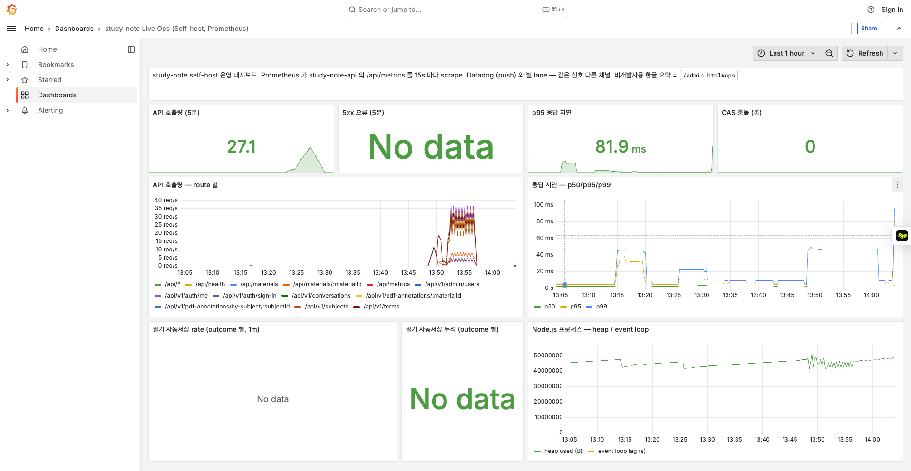
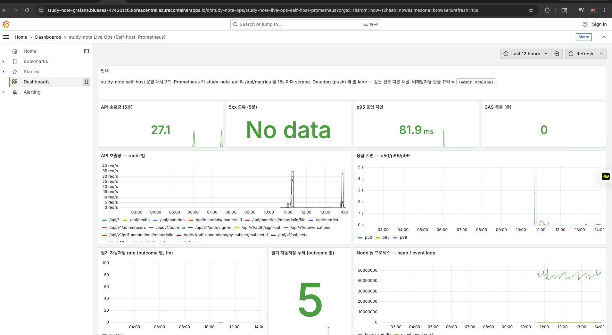
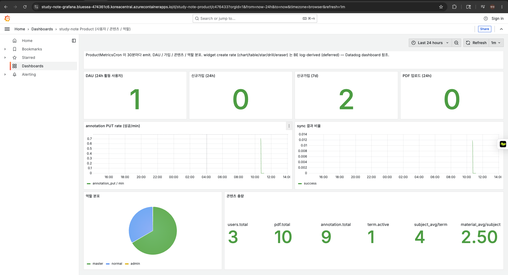
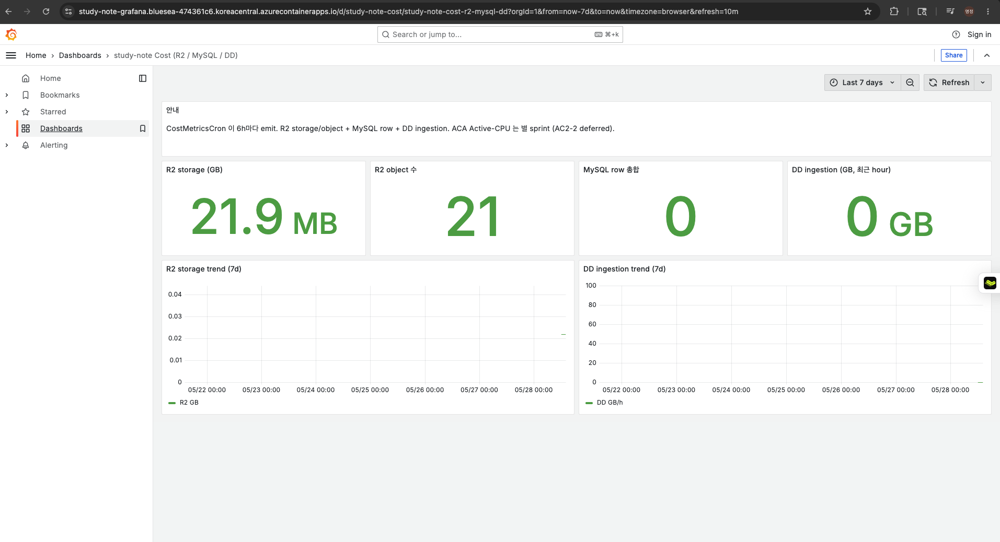
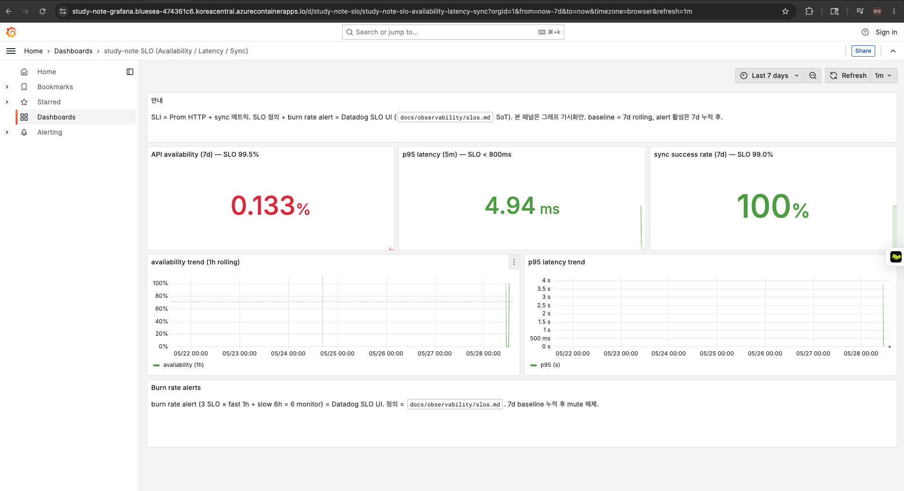
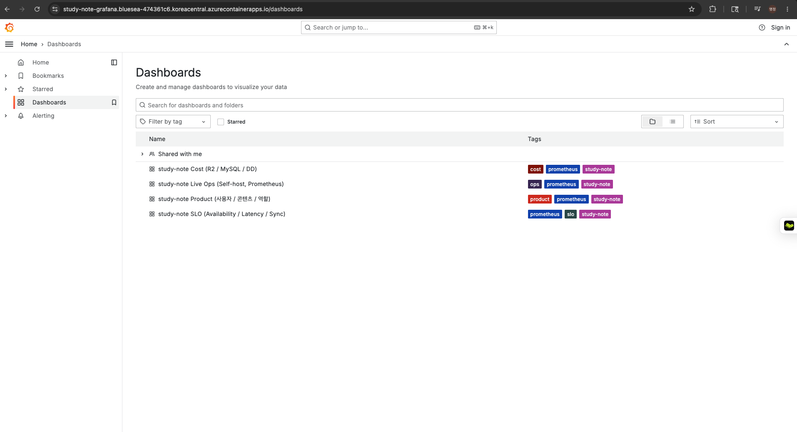
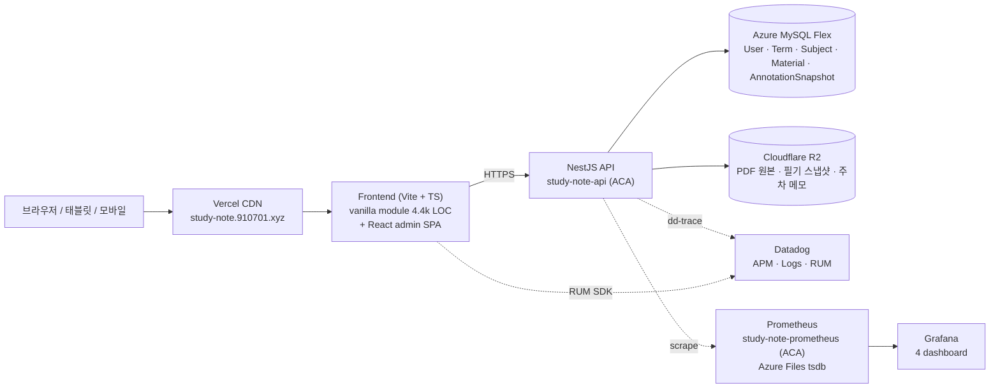

# study-note

study-note는 강의 PDF를 과목 단위로 정리하고, PDF 위에 직접 필기하며 복습 흐름을 이어갈 수 있게 돕는 학습 작업공간입니다.

## 무엇을 해결하나요

- 강의 PDF, 필기, 주차별 메모가 흩어지지 않도록 한곳에 모읍니다.
- 같은 강의자료를 여러 기기에서 열어도 본인의 필기 상태가 이어지도록 저장합니다.
- 운영자는 사용자와 학기/과목을 관리하고, 서비스 상태를 Grafana로 확인합니다.
- 향후 과목별 AI 튜터가 PDF 근거를 바탕으로 질문과 복습을 돕는 흐름까지 확장합니다.

## 주요 기능

- **학기/과목 관리**: 학기 아래 과목을 만들고 과목별 자료를 정리합니다.
- **PDF 자료실**: 강의 PDF를 업로드하고 과목에 연결합니다. 운영자가 올린 자료는 공유 자료로 사용할 수 있습니다.
- **PDF 작업공간**: PDF를 보면서 펜, 포스트잇, 별표(드래그 리사이즈), 체크리스트, 표, 그래프, 지우개로 필기를 남깁니다.
- **수업일 지정**: PDF 자료가 어느 수업일에 해당하는지 지정하거나 미지정 상태로 둘 수 있습니다.
- **자동저장 및 동기화**: PDF 필기와 주차 메모를 저장하고 같은 계정의 다른 기기에서 이어봅니다.
- **관리자 화면**: 사용자 승인, 권한 변경, 학기/과목 관리, 운영 지표 진입을 한곳에서 제공합니다.
- **운영 지표 v2**: APM, Product, Cost, SLO 네 종의 Grafana 대시보드로 시스템과 사용 추이를 분리해 살펴봅니다.

## 운영 환경

- 서비스: <https://study-note.910701.xyz>
- 관리자 콘솔: <https://study-note.910701.xyz/admin.html>
- 운영 지표 진입점: <https://study-note.910701.xyz/admin.html#ops>
- Grafana 대시보드 (4종, 용도별 분리)
  - APM Live Ops: <https://study-note-grafana.bluesea-474361c6.koreacentral.azurecontainerapps.io/d/study-note-ops/study-note-live-ops-self-host-prometheus?orgId=1&from=now-1h&to=now&timezone=browser&refresh=15s>
  - Product: <https://study-note-grafana.bluesea-474361c6.koreacentral.azurecontainerapps.io/d/study-note-product/c476433?orgId=1&from=now-24h&to=now&timezone=browser&refresh=1m>
  - Cost: <https://study-note-grafana.bluesea-474361c6.koreacentral.azurecontainerapps.io/d/study-note-cost/study-note-cost-r2-mysql-dd?orgId=1&from=now-7d&to=now&timezone=browser&refresh=10m>
  - SLO: <https://study-note-grafana.bluesea-474361c6.koreacentral.azurecontainerapps.io/d/study-note-slo/study-note-slo-availability-latency-sync?orgId=1&from=now-7d&to=now&timezone=browser&refresh=1m>

**리뷰어 접속 계정** (포트폴리오 검토용 데모 계정 — `REVIEWER` 권한):

| 이름 | 학번 |
|---|---|
| `리뷰어` | `20260000` |

[서비스](https://study-note.910701.xyz)에 접속해 위 이름·학번으로 로그인하면 됩니다(별도 비밀번호 없음). 이 계정은 일반 사용자 기능에 더해 **운영 지표(Grafana 대시보드 진입점)만** 열람할 수 있는 제한 권한이며, 사용자 관리·콘텐츠 관리 등 관리자 기능은 서버 단에서 차단됩니다. 백엔드는 트래픽이 일정 시간 없으면 절전 상태로 들어가므로, 절전 후 첫 요청(로그인 포함)은 몇 초 늦게 응답할 수 있습니다.

> **라이브 대시보드 운영 상태**: 🟢 **on-demand (scale-to-zero)** — Grafana + Prometheus 를 `min-replicas=0` 으로 운영합니다. 아무도 보지 않는 평상시에는 replica 가 0 으로 내려가 **컴퓨트 비용이 0** 이고, 위 링크에 접속하면 자동 기동되어 **수 초 cold start 후 라이브 대시보드**가 뜹니다. 즉시 확인용으로 아래 스냅샷도 함께 제공합니다.
>
> 💡 **운영 단가까지 설계한 선택**: 관측 스택조차 scale-to-zero 로 두어 "기능이 동작하는가" 를 넘어 "쓰지 않는 시간의 단가는 0 인가" 까지 설계했습니다. 상시 가동(`min-replicas=1`)도 가능하지만 idle 컴퓨트가 학생 크레딧을 갉아먹으므로, 가용성을 거의 잃지 않으면서 idle 비용을 0 으로 만드는 `min=0/max=1` 을 택했습니다. 토글·재활성화 절차 = `docs/runbooks/observability-toggle.md`.

<details>
<summary><b>📊 운영지표 대시보드 스냅샷 펼쳐보기</b> (라이브 대시보드 비활성 시 대체 자료)</summary>

<br/>

study-note 는 자체 호스팅 Prometheus + Grafana 로 4종 운영 대시보드를 운영합니다. 청중과 응답 주기가 다른 신호를 한 화면에 섞지 않도록 **시스템 / 비즈니스 / 비용 / 신뢰성** 으로 분리했습니다. 라이브 환경이 비활성일 때를 대비한 캡처입니다.

### 1. APM Live Ops — 시스템 신호
API 호출량 · 5xx · p95 지연 · CAS 충돌 · route 별 분포 · Node.js heap/event loop.

**왜 보나**: 장애와 성능 저하를 가장 먼저 드러내는 1차 신호입니다. 5xx 가 튀면 배포 롤백 판단, p95 가 임계(800ms)를 넘으면 cold-start·쿼리·외부 IO 병목 추적, heap/event-loop lag 로 메모리 누수와 이벤트 루프 blocking 을 조기 발견합니다. 배포 직후 가장 먼저 확인하는 화면입니다.

최근 1시간 (실시간):



최근 12시간 (부하 테스트 spike 포함 — 호출량/p95 의 wave 패턴):



### 2. Product — 비즈니스 신호
DAU · 신규가입(24h/7d) · PDF 업로드 · 콘텐츠 누적 · 역할 분포 · annotation/sync rate (30분 cron).

**왜 보나**: 시스템이 살아있는 것과 "사람이 실제로 쓰는 것"은 다릅니다. DAU·신규가입으로 성장 추이를, PDF 업로드·annotation rate 로 핵심 기능의 실사용을, 역할 분포로 운영자/일반 사용자 비율을 봅니다. 기능 우선순위와 온보딩 개선 여부를 데이터로 판단하는 근거입니다.



### 3. Cost — 비용 신호
R2 storage/object · MySQL row · Datadog ingestion (6시간 cron).

**왜 보나**: 개인 운영 프로젝트는 비용이 곧 지속 가능성입니다. R2 저장량·객체 수 증가율로 스토리지 비용을, Datadog ingestion 으로 관측 비용(이중 emit 영향)을, MySQL row 로 DB 증가를 추적합니다. "사용자당 비용(cost/DAU)" 이 임계를 넘기 전에 정리·아카이빙·요금제 전환을 결정합니다.



### 4. SLO — 신뢰성 신호
API availability 99.5% · p95 latency < 800ms · sync success 99.0% (7일 rolling) + burn rate.

**왜 보나**: "얼마나 안정적이어야 충분한가"를 숫자로 약속하고 그 약속의 소진(error budget)을 추적합니다. availability·latency·sync success 세 SLO 가 목표를 밑돌면 기능 개발보다 신뢰성 작업을 우선한다는 판단 기준이 됩니다. burn rate(소진 속도)로 "지금 당장 대응" vs "추적 관찰"을 구분합니다.



### 5. 대시보드 목록 (Grafana provisioning)
코드 SoT(`infra/grafana/dashboards/*.json`)에서 자동 provisioning 되는 4종.

**왜 보나**: 대시보드를 UI 에서 손으로 만들지 않고 JSON 으로 버전 관리한다는 증빙입니다. Grafana 컨테이너를 재기동하거나 새 환경에 띄워도 provisioning 으로 동일하게 복원되어, 관측 환경 자체가 재현 가능(IaC)함을 보여줍니다.



> 캡처 일자: 2026-05-28. 대시보드 정의는 `infra/grafana/dashboards/` 에 코드로 버전 관리되므로, Grafana 재기동 시 동일하게 복원됩니다. 운영 lane 구성 근거는 위 [구성 결정과 근거](#구성-결정과-근거) 표의 "관측 SoT" / "운영 지표 v2" 행을 참고하세요.

</details>

## 기본 사용 흐름

1. 로그인합니다.
2. 학기를 선택하고 과목으로 들어갑니다.
3. PDF 자료를 열거나 새로 업로드합니다.
4. PDF 작업공간에서 필기 도구를 사용해 메모를 남깁니다.
5. 필요한 경우 PDF 자료의 수업일을 지정합니다.
6. 다른 기기에서 같은 계정으로 접속해 저장된 필기와 메모를 확인합니다.
7. 관리자는 `/admin.html`에서 사용자와 학기/과목을 관리하고, `#ops` 탭에서 운영 대시보드로 이동합니다.

## 데이터 구조

```text
학기
└─ 과목
   ├─ PDF 자료
   │  └─ 개인 필기 (펜 · 포스트잇 · 별표 · 체크리스트 · 표 · 그래프 · 지우개)
   └─ 주차 노트
      └─ 자유 메모
```

앱 안에서 특별한 의미로 쓰는 단어는 [docs/glossary.md](docs/glossary.md)에 정리되어 있습니다.

## 아키텍처



### 구성 결정과 근거

| 결정 | 채택 | 근거 |
|---|---|---|
| Frontend 호스팅 | Vercel CDN | global edge + 무중단 배포 + preview URL 자동 제공. 정적 자산 위주의 SPA에 적합합니다. |
| Backend 호스팅 | Azure Container Apps (min-replicas=0) | 운영 비용을 0에 가깝게 유지하면서 NestJS 컨테이너 그대로 배포합니다. 절전 cold start는 GitHub Actions와 UptimeRobot의 1분 핑으로 완화합니다. |
| 관계형 데이터베이스 | Azure MySQL Flex | 사용자, 학기/과목 계층, 자료/스냅샷 메타데이터처럼 일관성이 중요한 데이터를 보관합니다. Flex 구성은 비용·운영 부담이 가장 가벼웠습니다. |
| 객체 스토리지 | Cloudflare R2 (S3 호환) | PDF 원본과 필기 페이로드처럼 큰 객체는 egress 비용이 부담입니다. R2는 egress가 0이라 강의자료 다운로드/동기화에 유리합니다. |
| 관측 SoT (이중 lane) | Prometheus + Datadog | Prometheus는 대시보드 정의가 코드 저장소에 함께 버전 관리되어 재현성과 변경 이력 추적이 용이하고, Datadog은 APM·Logs·RUM을 한 화면에서 묶어 trace 단위 디버깅이 빠릅니다. 둘의 책임을 분리해 운영합니다. |
| 운영 지표 v2 (4 dashboard) | APM · Product · Cost · SLO | 시스템 신호(APM), 비즈니스 신호(Product), 비용 신호(Cost), 신뢰성 신호(SLO)는 청중과 응답 주기가 달라 한 화면에 모으면 가독성이 떨어집니다. 용도별로 분리했습니다. |
| /api/metrics 보호 | `MetricsScrapeGuard` (Bearer / x-prometheus-token) | Product/Cost gauge에 비즈니스 지표가 포함되어 공개 노출은 부적절합니다. 토큰 미주입 시 fail-closed 403로 막습니다. |
| Prometheus tsdb 보관 | Azure Files persistent volume | 컨테이너 revision 교체 시 ephemeral 디스크가 비워지지 않도록 외부 볼륨에 영속화했습니다. |
| Monorepo 구조 | pnpm workspaces | `apps/*`와 `packages/*`가 같은 도메인 타입을 공유합니다. 패키지 간 빌드/타입 검사 동시 진행을 단일 명령으로 끝낼 수 있습니다. |

> **왜 AWS가 아니라 Azure인가 (그리고 Datadog).** 클라우드는 AWS가 사실상 업계 표준이고, 저 역시 AWS 환경이 더 익숙합니다. 그럼에도 Backend/DB를 Azure(Container Apps + MySQL Flexible Server)로 택한 결정적 이유는 **비용**입니다. 숭실대학교 컴퓨터학부 재학생으로 **학생 개발자 혜택(GitHub Student Developer Pack · Azure for Students)** 을 통해 Azure 크레딧을 지원받아, 개인 운영 프로젝트의 인프라 비용을 0에 가깝게 유지할 수 있었습니다. 관측 스택의 **Datadog**도 같은 원리입니다. Datadog은 APM·Logs·RUM 분야의 업계 표준이지만 개인 프로젝트가 정가로 감당하기엔 부담스러운 유료 도구입니다 — 학생 혜택으로 무상 지원받은 덕분에, 원래라면 비용 때문에 선택하기 어려웠을 production급 관측 도구를 그대로 구성할 수 있었습니다. 즉 "더 익숙하고 메이저한 스택(AWS)"보다 **"학생 혜택으로 production급 스택을 0원에 가깝게 운영한다"** 를 우선한 의도적 선택입니다. 단, egress 비용이 핵심인 객체 스토리지만은 학생 크레딧과 무관하게 **egress 0**인 Cloudflare R2를 별도로 골랐습니다(위 표 참고). 학생 혜택 종료 시 AWS(ECS/Fargate + RDS)로의 이전도 포트/어댑터 경계 덕분에 비교적 낮은 비용으로 가능하도록 설계했습니다.

> **왜 Spring Boot가 아니라 NestJS인가.** 저의 주력 스택은 **Spring Boot + Kotlin** 백엔드입니다. 그럼에도 이 프로젝트의 API를 NestJS로 구성한 이유는 세 가지입니다. ① **스터디** — 익숙한 Spring 대신 새 런타임/생태계를 직접 운영까지 경험. ② **서버 비용** — Azure Container Apps의 min-replicas=0 절전 모델에서 JVM 컨테이너는 cold start가 느리고 메모리 상주가 무거운 반면, Node 런타임은 기동이 가볍고 메모리 풋프린트가 작아 절전·과금에 유리. ③ **풀스택 속도** — FE와 BE를 모두 TypeScript로 통일해 도메인 타입을 한 패키지(`packages/domain`)에서 공유하고 컨텍스트 스위칭 없이 빠르게 반복.
>
> 핵심은 **Spring에서의 설계 개념을 NestJS에 1:1로 매핑**해 옮겼다는 점입니다. NestJS 자체가 Spring/Angular의 DI·모듈·데코레이터 사상을 계승했기에 이식이 자연스러웠습니다 — Spring의 `@Service`/`@Repository`/생성자 주입 ↔ Nest `@Injectable` + 모듈 provider, `@RestController` ↔ `@Controller`, Spring Security 필터 체인 ↔ `SessionAuthGuard`/`RoleGuard`(`@Roles`), `@ControllerAdvice`+`@ExceptionHandler` ↔ 전역 `ApiExceptionFilter`(4xx warn / 5xx error 로깅), Bean Validation ↔ `ValidationPipe`+`@Valid`(Shield 패턴). 외부 시스템 경계는 포트/어댑터(헥사고날)로 의존성을 역전했고(스토리지 `StoragePort`·LLM `LlmProvider`/`LLM_PROVIDER` — 교체 가능한 adapter), DB 접근은 aggregate별 Repository 패턴으로 Prisma를 캡슐화했습니다(이쪽은 헥사고날 port가 아니라 영속 캡슐화). 즉 "새 언어를 처음 배우며 만든 결과물"이 아니라 **숙련된 백엔드 설계 원칙을 새 런타임으로 빠르게 이식한 결과물**입니다.

### 디렉토리와 책임 경계

- `apps/web`은 사용자가 만나는 UI를 담당합니다. 메인 작업공간은 `apps/web/src/main.ts`를 중심으로 모듈을 분리하고, 관리자 화면은 React 기반 별도 SPA(`apps/web/src/admin/`)로 운영합니다.
- `apps/api`는 NestJS 컨트롤러·서비스 계층이 위치합니다. 관측 모듈(`observability/`), 텔레메트리(`telemetry/`), 권한(`auth/`) 등이 분리되어 있습니다.
- `packages/domain`은 외부 의존이 없는 순수 도메인 타입과 reducer를 보관합니다. side-effect를 도메인 밖으로 빼는 작업을 진행하고 있습니다.
- `packages/storage`는 진짜 포트/어댑터(헥사고날) 경계입니다 — 서비스는 `StoragePort`(추상)만 주입받고 R2/S3·로컬 목 어댑터를 갈아끼웁니다. `packages/persistence`는 Prisma를 감싸 aggregate별 Repository로 영속 접근을 캡슐화하고(port 역전이 아니라 캡슐화), `packages/auth`는 세션 인증과 권한 가드를 담당합니다.
- `packages/corpus`, `packages/persona-engine`, `apps/cli`, `apps/mcp`는 향후 AI 튜터 흐름의 실험 영역입니다.

자세한 컨텍스트 맵은 [llm-wiki/ddd/context-map.md](llm-wiki/ddd/context-map.md)에 정리되어 있습니다.

## 레포지토리 구성

| 경로 | 역할 |
|---|---|
| `apps/web` | 사용자 앱, 관리자 SPA, PDF 작업공간 |
| `apps/api` | 인증, 자료, 필기, 관리자 API, 관측 모듈 |
| `apps/cli` | PDF 인덱싱 및 과목 튜터 실험용 CLI |
| `apps/mcp` | 외부 AI 도구와 연결하기 위한 MCP 서버 |
| `packages/domain` | 학습 노트와 PDF 필기 도메인 타입 (pure) |
| `packages/auth` | 세션 인증과 권한 가드 |
| `packages/persistence` | Prisma schema, migration, seed |
| `packages/storage` | R2/S3 호환 스토리지 어댑터 |
| `packages/corpus` | PDF 텍스트 추출과 검색용 청크 처리 |
| `packages/persona-engine` | 과목별 튜터 응답 흐름의 실험 구현 |
| `infra/prometheus` | `study-note-prometheus` 컨테이너 이미지와 scrape 설정 |
| `infra/grafana` | `study-note-grafana` 컨테이너 이미지, 대시보드 JSON, provisioning |

## 핵심 엔지니어링 결정 (How & Why)

이 프로젝트가 "무엇을 하는가"는 위에서, "어떻게 만들었는가"는 여기서 다룹니다. 아래는 실제 코드에 근거한 백엔드 설계 결정들입니다.

### 1. 멀티기기 동기화의 동시성 제어 — 락 없는 Hybrid CAS + 보상

같은 계정을 노트북·태블릿에서 동시에 열면 한 PDF의 필기 스냅샷에 **동시 쓰기(write-write)** 가 발생합니다. 이를 비관적 락 없이, 메타데이터(MySQL)와 페이로드(R2)를 나눠 다루는 낙관적 동시성(Compare-And-Swap)으로 해결했습니다.

핵심은 `savedAt`(리비전)을 `WHERE` 절에 넣어 갱신 자체를 락으로 쓰는 것입니다. 클라이언트가 보낸 리비전이 DB의 현재 리비전과 일치할 때만 `updateMany`가 1행을 갱신하고, 그 1행을 잡은 요청만 R2에 페이로드를 씁니다.

```ts
// apps/api/src/pdf-annotations/annotation-snapshot.repository.ts
// savedAt 이 expectedSavedAt 인 row 만 갱신. count=1 → 본 호출이 lock 획득.
async casUpdateSavedAt(materialId, ownerId, expectedSavedAt, newSavedAt) {
  return this.prisma.annotationSnapshot.updateMany({
    where: { materialId, ownerId, savedAt: expectedSavedAt }, // ← where 절이 곧 lock
    data: { savedAt: newSavedAt }
  });
}
```

CAS 결과에 따라 서비스가 분기합니다 (`pdf-annotations.service.ts`):

- `count === 1` (선점 성공): R2에 페이로드를 쓰고, **R2 쓰기가 실패하면 `savedAt`을 이전 값으로 되돌려(rollback)** MySQL과 R2의 정합성을 맞춥니다. 메타데이터와 객체 스토리지에 걸친 쓰기를 보상 트랜잭션으로 묶은 것입니다.
- `count === 0` (리비전 불일치): `409 STALE_REVISION`을 반환하되, **응답 본문에 서버의 최신 정본(canonical) 스냅샷을 함께 실어** 클라이언트가 곧바로 재조정(replay)할 수 있게 합니다.
- 보상 삭제는 "정확히 내가 만든 리비전인 row만" 지우는 compare-and-delete로, 그 사이 다른 CAS가 가져간 row를 지워 데이터가 유실되는 일을 막습니다.

> 이 충돌은 막연히 추정하는 값이 아니라 **APM 대시보드의 `CAS 충돌` 지표**로 실시간 관측되며(`MetricsService.observeSyncPut("stale")`), 동시성 설계가 실제로 동작하는지를 운영 데이터로 확인합니다.

### 2. 횡단 관심사 분리 — Guard로 fail-closed 보호

인증·권한·메트릭 보호 같은 횡단 관심사는 비즈니스 로직에서 들어내 NestJS Guard로 분리했습니다. 권한은 데코레이터로 선언하고 Guard가 강제합니다.

```ts
// packages/auth/src/role.guard.ts — 선언적 RBAC (MASTER / ADMIN / NORMAL)
export const Roles = (...roles: UserRole[]) => SetMetadata(ROLES_KEY, roles);
```

`/api/metrics`는 Product·Cost gauge에 비즈니스 지표가 포함되어 공개 노출이 곧 정보 유출입니다. 그래서 토큰이 **설정되지 않았거나 틀리면 기본값이 차단(fail-closed)** 이고, 토큰 비교는 타이밍 공격을 막는 상수 시간 비교를 씁니다.

```ts
// apps/api/src/observability/metrics-scrape.guard.ts
if (!expected) throw new ForbiddenException({ errorCode: "METRICS_NOT_CONFIGURED" });
if (!constantTimeEqual(presented, expected))      // timingSafeEqual 기반
  throw new ForbiddenException({ errorCode: "METRICS_FORBIDDEN" });
```

### 3. 세션 보안 — 평문 미저장 + fail-closed

세션 토큰은 발급 시 32바이트 난수로 만들고, **DB에는 원본이 아닌 HMAC-SHA256 해시만** 저장합니다. 원본 토큰은 클라이언트에만 전달되어, DB가 유출돼도 세션을 위조할 수 없습니다. pepper가 없으면 정적 fallback 없이 즉시 throw 하는 fail-closed 정책입니다.

```ts
// packages/auth/src/sessions.service.ts
const token = randomBytes(32).toString("base64url");      // 원본은 클라이언트에만
await this.prisma.session.create({ data: { tokenHash: hashSessionToken(token), ... } });
// pepper 미설정 시 fail-closed (정적 fallback 제거)
if (!pepper) throw new Error("SESSION_TOKEN_PEPPER missing — fail-closed");
return createHmac("sha256", pepper).update(token).digest("hex");
```

### 4. 도메인 모델링 — setter 배제, 순수 reducer

`packages/domain`은 외부 의존이 없는 순수 타입과 함수만 둡니다. 모든 상태 변경은 setter가 아니라 **의미 있는 reducer 함수**를 거치며, 입력을 변형하지 않고 불변 스프레드로 새 값을 반환합니다. side-effect가 없어 테스트와 재현(replay)이 쉽습니다.

```ts
// packages/domain/src/pdf-workspace.ts — 입력 불변, 의미 있는 메서드로만 상태 전이
export function updateTextBoxContent(textBox: PdfTextBox, content: string): PdfTextBox {
  return { ...textBox, content: content.slice(0, TEXT_BOX_CONTENT_CAP),
           updatedAt: new Date().toISOString() };
}
```

타임스탬프를 선택 인자(`at?`)로 주입할 수 있어, 같은 입력이면 같은 id가 나오는 결정론적 테스트가 가능합니다(미주입 시 기존 동작 유지).

### 5. 포트/어댑터로 외부 시스템 격리

서비스는 구체 SDK가 아니라 추상 포트에만 의존합니다. 스토리지의 경우 서비스가 `StoragePort`만 주입받고, R2/S3 구현(`S3StorageService`)은 어댑터로 갈아끼웁니다. 덕분에 테스트는 목(mock)을, 운영은 R2를 쓰며 서비스 코드에는 AWS SDK 결합이 0입니다.

```ts
// apps/api/src/pdf-annotations/pdf-annotations.service.ts
constructor(@Inject(StoragePort) private readonly storage: StoragePort, /* ... */) {}
```

### 6. 테스트 전략 — 명세 기반 + 실연결 스모크

핵심 로직은 Node.js 내장 test 러너로 단위 검증하고(외부 프레임워크 의존 없음), 인수 기준(AC) 단위로 명세화된 스펙(예: CAS 선점/stale/롤백 경로, 권한 분기)을 검증합니다. 그 위에 `scripts/smoke-*.mjs`로 빌드된 백엔드를 띄워 인증·관리자 권한·S3 저장·MCP 등을 계약(contract) 수준에서 점검하며, 실제 R2 버킷을 쓰는 스모크는 credential이 있을 때만 opt-in으로 돕니다.

백엔드 계약 스모크(`smoke:backend`)는 로컬 수동 실행에 더해 GitHub Actions 게이트(`.github/workflows/smoke.yml`)로 PR·main push 마다 자동 실행됩니다. 러너가 docker compose 로 MySQL을 자체 기동하고 마이그레이션·시드까지 수행한 뒤 계약 검증을 돌려, 계약 회귀를 머지 전에 차단합니다.

### 7. DI 싱글톤 — provider scope로 공유 인스턴스 보장

NestJS provider는 기본 Scope.DEFAULT(singleton scope)로 등록되어 IoC 컨테이너가 앱 전체에서 인스턴스를 1개만 유지합니다. Spring의 `@Service`/`@Component` bean이 기본 singleton scope로 관리되는 것과 동일한 원리입니다.

`StoragePort`(외부 어댑터)와 `PrismaClient`(DB 클라이언트)처럼 연결·상태를 공유해야 하는 인프라는 `@Global` 모듈에서 한 번만 등록하고 export합니다. 이전 구현은 materials·pdf-annotations·user-notes 세 모듈이 `StoragePort` provider를 각자 등록해 인스턴스가 3개 생겼고, in-memory 상태를 가진 local-mock 환경에서 cross-module 읽기가 깨졌습니다. `@Global` 단일 등록으로 이를 수정하면서 `PrismaModule`과 동일한 패턴으로 통일했습니다.

```ts
// apps/api/src/storage/storage.module.ts
@Global()   // 1회 등록 → app-wide 단일 인스턴스
@Module({
  providers: [{ provide: StoragePort, useFactory: createStorageProvider }],
  exports: [StoragePort]
})
export class StorageModule {}
```

모듈 스코프 변수나 static 필드로 인스턴스를 직접 공유하는 방식은 DI 컨테이너를 우회해 테스트에서 mock 교체가 불가능해집니다. `StoragePort`는 unit spec에서 교체 대상이므로 DI 관리 싱글톤이 적합합니다.

## 운영 관측

운영 지표는 Prometheus와 Datadog 두 lane으로 분리되어 있습니다.

- Prometheus는 코드와 함께 버전 관리되는 SoT 대시보드입니다.
- Datadog은 trace와 log를 한 화면에서 추적해야 할 때 사용합니다.

NestJS 백엔드의 메트릭 emit 경로는 다음과 같습니다.

| 카테고리 | 출처 | 갱신 주기 | Grafana 대시보드 |
|---|---|---|---|
| HTTP / sync | `HttpMetricsMiddleware`, `MetricsService.observeSyncPut` | 요청마다 | APM Live Ops |
| Product 13 gauge | `ProductMetricsCronService` | 부팅 시 1회 + 30분마다 | Product |
| Cost 4 gauge | `CostMetricsCronService` | 부팅 시 1회 + 6시간마다 | Cost |
| SLO 3 (availability · p95 · sync success) | HTTP/sync 메트릭을 SLO 쿼리로 재계산 | 실시간 | SLO |
| Log-derived 10 (auth/identity 5 + widget 5) | Datadog 로그 파이프라인 | 실시간 | Datadog UI |

`/api/metrics`는 `Authorization: Bearer <token>`(권장) 또는 `x-prometheus-token`을 요구합니다. 토큰이 없으면 `403 METRICS_FORBIDDEN`을 반환합니다. 운영 환경의 토큰은 Azure Container Apps secret에 저장되며 `study-note-prometheus` scrape config에서 같은 secret을 파일 마운트로 읽습니다.

세부 정의는 다음 문서를 참고하세요.

- 메트릭 네이밍과 태그 정책: [docs/standards/metric-spec.md](docs/standards/metric-spec.md)
- 로그 기반 메트릭 SoT: [docs/observability/log-derived-metrics.md](docs/observability/log-derived-metrics.md)
- SLO 정의와 burn rate 알림: [docs/observability/slos.md](docs/observability/slos.md)
- cron cold start와 TZ 메모: [docs/observability/cron-cold-start.md](docs/observability/cron-cold-start.md)
- 대시보드 안내: [docs/monitoring/dashboards.md](docs/monitoring/dashboards.md)

## 기술 스택

- Frontend: Vite, TypeScript, vanilla TS 모듈 + React admin SPA, pdfjs-dist
- Backend: NestJS, Express, Prisma, `@nestjs/schedule`
- Database: Azure MySQL Flex
- Storage: Cloudflare R2 (S3 호환)
- Hosting: Vercel (Frontend), Azure Container Apps (Backend, Prometheus, Grafana)
- Monitoring: Prometheus + Grafana (4 dashboard), Datadog (APM · Logs · RUM)
- Package manager: pnpm workspaces

## 로컬 실행

```bash
pnpm install
cp .env.example .env
pnpm run prisma:generate
pnpm run prisma:migrate:deploy
pnpm run prisma:seed
```

백엔드:

```bash
pnpm run dev:backend
```

프론트엔드:

```bash
pnpm run dev
```

기본 개발 계정 예시는 `.env.example`에 있습니다. 실제 이름, 학번, 이메일 등 개인 값은 `.env`에만 넣고 git에는 올리지 않습니다.

## 검증

```bash
pnpm run build
pnpm run test:backend
pnpm run smoke:backend
pnpm run smoke:pdf-workspace
pnpm run smoke:s3-storage
```

실제 R2 버킷을 사용하는 스모크 테스트는 credential이 준비된 환경에서만 opt-in으로 실행합니다.

```bash
RUN_REAL_S3_SMOKE=1 pnpm run smoke:s3-real
```

프로덕션 프런트 스모크는 Playwright 스크립트로 분리되어 있습니다.

```bash
node scripts/playwright-prod-smoke.mjs
```

## 관련 문서

- 용어집: [docs/glossary.md](docs/glossary.md)
- 운영 대시보드 안내: [docs/monitoring/dashboards.md](docs/monitoring/dashboards.md)
- API 모듈 개요: [llm-wiki/modules/apps-api.md](llm-wiki/modules/apps-api.md)
- DDD 컨텍스트 맵: [llm-wiki/ddd/context-map.md](llm-wiki/ddd/context-map.md)

## 다음 방향

- PDF 작업공간의 모바일 사용성을 계속 개선합니다.
- 과목별 AI 튜터를 PDF 근거 기반으로 확장합니다.
- 프론트엔드의 오래된 화면을 React 컴포넌트 구조로 점진 전환합니다.
- DDD 전수조사에서 식별한 리팩토링 슬라이스를 단계적으로 진행합니다 (Repository 패턴 확장, 도메인 모델 강화, Bounded Context 정리).
- SLO 7일 baseline이 누적되면 burn rate 알림을 활성화합니다.

## 운영 메모

- `local-materials/`는 로컬 강의자료 보관용이며 git에 올리지 않습니다.
- `.env`와 credential은 git에 올리지 않습니다.
- 운영 환경 secret(Database URL, S3 키, Datadog 키, Prometheus 토큰 등)은 Azure Container Apps secret으로만 관리합니다.
- 운영 대시보드(Grafana/Prometheus) 비활성화·재활성화 절차는 [docs/runbooks/observability-toggle.md](docs/runbooks/observability-toggle.md)에 정리되어 있습니다.
