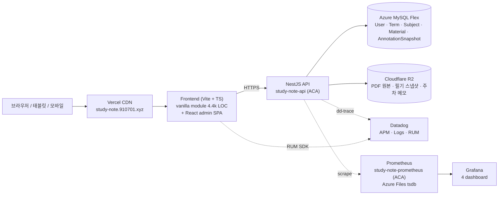

# study-note

study-note는 강의 PDF를 과목 단위로 정리하고, PDF 위에 직접 필기하며 복습 흐름을 이어갈 수 있게 돕는 학습 작업공간입니다.

## 무엇을 해결하나요

- 강의 PDF, 필기, 주차별 메모가 흩어지지 않도록 한곳에 모읍니다.
- 같은 강의자료를 여러 기기에서 열어도 본인의 필기 상태가 이어지도록 저장합니다.
- 운영자는 사용자와 학기/과목을 관리하고, 서비스 상태를 Grafana로 확인합니다.
- 향후 과목별 AI 튜터가 PDF 근거를 바탕으로 질문과 복습을 돕는 흐름까지 확장합니다.

## 주요 기능

- **학기/과목 관리**: 학기 아래 과목을 만들고 과목별 자료를 정리합니다.
- **PDF 자료실**: 강의 PDF를 업로드하고 과목에 연결합니다. 운영자가 올린 자료는 공유 자료로 사용할 수 있습니다.
- **PDF 작업공간**: PDF를 보면서 펜, 포스트잇, 별표(드래그 리사이즈), 체크리스트, 표, 그래프, 지우개로 필기를 남깁니다.
- **수업일 지정**: PDF 자료가 어느 수업일에 해당하는지 지정하거나 미지정 상태로 둘 수 있습니다.
- **자동저장 및 동기화**: PDF 필기와 주차 메모를 저장하고 같은 계정의 다른 기기에서 이어봅니다.
- **관리자 화면**: 사용자 승인, 권한 변경, 학기/과목 관리, 운영 지표 진입을 한곳에서 제공합니다.
- **운영 지표 v2**: APM, Product, Cost, SLO 네 종의 Grafana 대시보드로 시스템과 사용 추이를 분리해 살펴봅니다.

## 시연 경로

- 서비스: <https://study-note.910701.xyz>
- 관리자 화면: <https://study-note.910701.xyz/admin.html>
- 운영 지표 진입: <https://study-note.910701.xyz/admin.html#ops>
- Grafana 대시보드 (4종, 용도별 분리)
  - APM Live Ops: <https://study-note-grafana.bluesea-474361c6.koreacentral.azurecontainerapps.io/d/study-note-ops/study-note-live-ops-self-host-prometheus?orgId=1&from=now-1h&to=now&timezone=browser&refresh=15s>
  - Product: <https://study-note-grafana.bluesea-474361c6.koreacentral.azurecontainerapps.io/d/study-note-product/c476433?orgId=1&from=now-24h&to=now&timezone=browser&refresh=1m>
  - Cost: <https://study-note-grafana.bluesea-474361c6.koreacentral.azurecontainerapps.io/d/study-note-cost/study-note-cost-r2-mysql-dd?orgId=1&from=now-7d&to=now&timezone=browser&refresh=10m>
  - SLO: <https://study-note-grafana.bluesea-474361c6.koreacentral.azurecontainerapps.io/d/study-note-slo/study-note-slo-availability-latency-sync?orgId=1&from=now-7d&to=now&timezone=browser&refresh=1m>

시연 계정은 운영자가 별도로 안내합니다. 백엔드는 사용량이 없으면 절전 상태가 될 수 있어 첫 요청이 몇 초 정도 늦게 응답할 수 있습니다.

## 기본 사용 흐름

1. 로그인합니다.
2. 학기를 선택하고 과목으로 들어갑니다.
3. PDF 자료를 열거나 새로 업로드합니다.
4. PDF 작업공간에서 필기 도구를 사용해 메모를 남깁니다.
5. 필요한 경우 PDF 자료의 수업일을 지정합니다.
6. 다른 기기에서 같은 계정으로 접속해 저장된 필기와 메모를 확인합니다.
7. 관리자는 `/admin.html`에서 사용자와 학기/과목을 관리하고, `#ops` 탭에서 운영 대시보드로 이동합니다.

## 데이터 구조

```text
학기
└─ 과목
   ├─ PDF 자료
   │  └─ 개인 필기 (펜 · 포스트잇 · 별표 · 체크리스트 · 표 · 그래프 · 지우개)
   └─ 주차 노트
      └─ 자유 메모
```

앱 안에서 특별한 의미로 쓰는 단어는 [docs/glossary.md](docs/glossary.md)에 정리되어 있습니다.

## 아키텍처



### 구성 결정과 근거

| 결정 | 채택 | 근거 |
|---|---|---|
| Frontend 호스팅 | Vercel CDN | global edge + 무중단 배포 + preview URL 자동 제공. 정적 자산 위주의 SPA에 적합합니다. |
| Backend 호스팅 | Azure Container Apps (min-replicas=0) | 운영 비용을 0에 가깝게 유지하면서 NestJS 컨테이너 그대로 배포합니다. 절전 cold start는 GitHub Actions와 UptimeRobot의 1분 핑으로 완화합니다. |
| 관계형 데이터베이스 | Azure MySQL Flex | 사용자, 학기/과목 계층, 자료/스냅샷 메타데이터처럼 일관성이 중요한 데이터를 보관합니다. Flex 구성은 비용·운영 부담이 가장 가벼웠습니다. |
| 객체 스토리지 | Cloudflare R2 (S3 호환) | PDF 원본과 필기 페이로드처럼 큰 객체는 egress 비용이 부담입니다. R2는 egress가 0이라 강의자료 다운로드/동기화에 유리합니다. |
| 관측 SoT (이중 lane) | Prometheus + Datadog | Prometheus는 코드 SoT 대시보드로 면접/시연·재현성에 강하고, Datadog은 APM/Logs/RUM 한 화면에서 trace 추적이 빠릅니다. 둘을 분리해 책임을 나눴습니다. |
| 운영 지표 v2 (4 dashboard) | APM · Product · Cost · SLO | 시스템 신호(APM), 비즈니스 신호(Product), 비용 신호(Cost), 신뢰성 신호(SLO)는 청중과 응답 주기가 달라 한 화면에 모으면 가독성이 떨어집니다. 용도별로 분리했습니다. |
| /api/metrics 보호 | `MetricsScrapeGuard` (Bearer / x-prometheus-token) | Product/Cost gauge에 비즈니스 지표가 포함되어 공개 노출은 부적절합니다. 토큰 미주입 시 fail-closed 403로 막습니다. |
| Prometheus tsdb 보관 | Azure Files persistent volume | 컨테이너 revision 교체 시 ephemeral 디스크가 비워지지 않도록 외부 볼륨에 영속화했습니다. |
| Monorepo 구조 | pnpm workspaces | `apps/*`와 `packages/*`가 같은 도메인 타입을 공유합니다. 패키지 간 빌드/타입 검사 동시 진행을 단일 명령으로 끝낼 수 있습니다. |

### 디렉토리와 책임 경계

- `apps/web`은 사용자가 만나는 UI를 담당합니다. 메인 작업공간은 `apps/web/src/main.ts`를 중심으로 모듈을 분리하고, 관리자 화면은 React 기반 별도 SPA(`apps/web/src/admin/`)로 운영합니다.
- `apps/api`는 NestJS 컨트롤러·서비스 계층이 위치합니다. 관측 모듈(`observability/`), 텔레메트리(`telemetry/`), 권한(`auth/`) 등이 분리되어 있습니다.
- `packages/domain`은 외부 의존이 없는 순수 도메인 타입과 reducer를 보관합니다. side-effect를 도메인 밖으로 빼는 작업을 진행하고 있습니다.
- `packages/auth`, `packages/storage`, `packages/persistence`는 포트와 어댑터 경계입니다. 서비스는 포트를 통해서만 외부 시스템에 접근합니다.
- `packages/corpus`, `packages/persona-engine`, `apps/cli`, `apps/mcp`는 향후 AI 튜터 흐름의 실험 영역입니다.

자세한 컨텍스트 맵은 [llm-wiki/ddd/context-map.md](llm-wiki/ddd/context-map.md)에 정리되어 있습니다.

## 레포지토리 구성

| 경로 | 역할 |
|---|---|
| `apps/web` | 사용자 앱, 관리자 SPA, PDF 작업공간 |
| `apps/api` | 인증, 자료, 필기, 관리자 API, 관측 모듈 |
| `apps/cli` | PDF 인덱싱 및 과목 튜터 실험용 CLI |
| `apps/mcp` | 외부 AI 도구와 연결하기 위한 MCP 서버 |
| `packages/domain` | 학습 노트와 PDF 필기 도메인 타입 (pure) |
| `packages/auth` | 세션 인증과 권한 가드 |
| `packages/persistence` | Prisma schema, migration, seed |
| `packages/storage` | R2/S3 호환 스토리지 어댑터 |
| `packages/corpus` | PDF 텍스트 추출과 검색용 청크 처리 |
| `packages/persona-engine` | 과목별 튜터 응답 흐름의 실험 구현 |
| `infra/prometheus` | `study-note-prometheus` 컨테이너 이미지와 scrape 설정 |
| `infra/grafana` | `study-note-grafana` 컨테이너 이미지, 대시보드 JSON, provisioning |

## 운영 관측

운영 지표는 Prometheus와 Datadog 두 lane으로 분리되어 있습니다.

- Prometheus는 코드와 함께 버전 관리되는 SoT 대시보드입니다.
- Datadog은 trace와 log를 한 화면에서 추적해야 할 때 사용합니다.

NestJS 백엔드의 메트릭 emit 경로는 다음과 같습니다.

| 카테고리 | 출처 | 갱신 주기 | Grafana 대시보드 |
|---|---|---|---|
| HTTP / sync | `HttpMetricsMiddleware`, `MetricsService.observeSyncPut` | 요청마다 | APM Live Ops |
| Product 13 gauge | `ProductMetricsCronService` | 부팅 시 1회 + 30분마다 | Product |
| Cost 4 gauge | `CostMetricsCronService` | 부팅 시 1회 + 6시간마다 | Cost |
| SLO 3 (availability · p95 · sync success) | HTTP/sync 메트릭을 SLO 쿼리로 재계산 | 실시간 | SLO |
| Log-derived 10 (auth/identity 5 + widget 5) | Datadog 로그 파이프라인 | 실시간 | Datadog UI |

`/api/metrics`는 `Authorization: Bearer <token>`(권장) 또는 `x-prometheus-token`을 요구합니다. 토큰이 없으면 `403 METRICS_FORBIDDEN`을 반환합니다. 운영 환경의 토큰은 Azure Container Apps secret에 저장되며 `study-note-prometheus` scrape config에서 같은 secret을 파일 마운트로 읽습니다.

세부 정의는 다음 문서를 참고하세요.

- 메트릭 네이밍과 태그 정책: [docs/standards/metric-spec.md](docs/standards/metric-spec.md)
- 로그 기반 메트릭 SoT: [docs/observability/log-derived-metrics.md](docs/observability/log-derived-metrics.md)
- SLO 정의와 burn rate 알림: [docs/observability/slos.md](docs/observability/slos.md)
- cron cold start와 TZ 메모: [docs/observability/cron-cold-start.md](docs/observability/cron-cold-start.md)
- 대시보드 안내: [docs/monitoring/dashboards.md](docs/monitoring/dashboards.md)

## 기술 스택

- Frontend: Vite, TypeScript, vanilla TS 모듈 + React admin SPA, pdfjs-dist
- Backend: NestJS, Express, Prisma, `@nestjs/schedule`
- Database: Azure MySQL Flex
- Storage: Cloudflare R2 (S3 호환)
- Hosting: Vercel (Frontend), Azure Container Apps (Backend, Prometheus, Grafana)
- Monitoring: Prometheus + Grafana (4 dashboard), Datadog (APM · Logs · RUM)
- Package manager: pnpm workspaces

## 로컬 실행

```bash
pnpm install
cp .env.example .env
pnpm run prisma:generate
pnpm run prisma:migrate:deploy
pnpm run prisma:seed
```

백엔드:

```bash
pnpm run dev:backend
```

프론트엔드:

```bash
pnpm run dev
```

기본 개발 계정 예시는 `.env.example`에 있습니다. 실제 이름, 학번, 이메일 등 개인 값은 `.env`에만 넣고 git에는 올리지 않습니다.

## 검증

```bash
pnpm run build
pnpm run test:backend
pnpm run smoke:backend
pnpm run smoke:pdf-workspace
pnpm run smoke:s3-storage
```

실제 R2 버킷을 사용하는 스모크 테스트는 credential이 준비된 환경에서만 opt-in으로 실행합니다.

```bash
RUN_REAL_S3_SMOKE=1 pnpm run smoke:s3-real
```

프로덕션 프런트 스모크는 Playwright 스크립트로 분리되어 있습니다.

```bash
node scripts/playwright-prod-smoke.mjs
```

## 관련 문서

- 용어집: [docs/glossary.md](docs/glossary.md)
- 운영 대시보드 안내: [docs/monitoring/dashboards.md](docs/monitoring/dashboards.md)
- API 모듈 개요: [llm-wiki/modules/apps-api.md](llm-wiki/modules/apps-api.md)
- DDD 컨텍스트 맵: [llm-wiki/ddd/context-map.md](llm-wiki/ddd/context-map.md)
- DDD 전수조사 보고서: [docs/solon/handoff/20260528-ddd-audit.md](docs/solon/handoff/20260528-ddd-audit.md)

## 다음 방향

- PDF 작업공간의 모바일 사용성을 계속 개선합니다.
- 과목별 AI 튜터를 PDF 근거 기반으로 확장합니다.
- 프론트엔드의 오래된 화면을 React 컴포넌트 구조로 점진 전환합니다.
- DDD 전수조사에서 식별한 리팩토링 슬라이스를 단계적으로 진행합니다 (Repository 패턴 확장, 도메인 모델 강화, Bounded Context 정리).
- SLO 7일 baseline이 누적되면 burn rate 알림을 활성화합니다.

## 운영 메모

- `local-materials/`는 로컬 강의자료 보관용이며 git에 올리지 않습니다.
- `.env`와 credential은 git에 올리지 않습니다.
- 운영 환경 secret(Database URL, S3 키, Datadog 키, Prometheus 토큰 등)은 Azure Container Apps secret으로만 관리합니다.
- 운영 cutover 절차는 [docs/solon/handoff/20260528-sprint-24-ops-metrics-v2-implement.md](docs/solon/handoff/20260528-sprint-24-ops-metrics-v2-implement.md)에 정리되어 있습니다.
