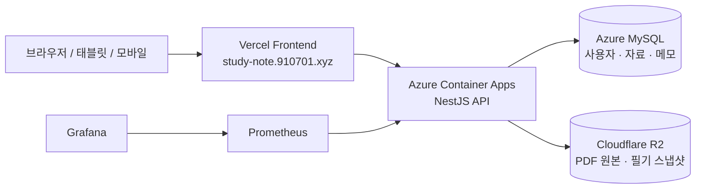

# study-note

study-note는 강의 PDF를 과목 단위로 정리하고, PDF 위에 직접 필기하며 복습 흐름을 이어갈 수 있게 돕는 학습 작업공간입니다.

## 무엇을 해결하나요

- 강의 PDF, 필기, 주차별 메모가 흩어지지 않도록 한곳에 모읍니다.
- 같은 강의자료를 여러 기기에서 열어도 본인의 필기 상태가 이어지도록 저장합니다.
- 운영자는 수업 자료와 사용자를 관리하고, 서비스 상태를 Grafana로 확인할 수 있습니다.
- 향후 과목별 AI 튜터가 PDF 근거를 바탕으로 질문과 복습을 돕는 흐름까지 확장합니다.

## 주요 기능

- **학기/과목 관리**: 학기 아래 과목을 만들고 과목별 자료를 정리합니다.
- **PDF 자료실**: 강의 PDF를 업로드하고 과목에 연결합니다. 운영자가 올린 자료는 공유 자료로 사용할 수 있습니다.
- **PDF 작업공간**: PDF를 보면서 펜, 포스트잇, 별표, 체크리스트, 표, 그래프 필기를 남깁니다.
- **수업일 지정**: PDF 자료가 어느 수업일에 해당하는지 지정하거나 미지정 상태로 둘 수 있습니다.
- **자동저장 및 동기화**: PDF 필기와 주차 메모를 저장하고 같은 계정의 다른 기기에서 이어봅니다.
- **관리자 화면**: 사용자 승인, 권한 변경, 학기/과목 관리를 제공합니다.
- **운영 지표**: Grafana 대시보드에서 API 호출량, 오류, 지연 시간, 저장 충돌 등을 확인합니다.

## 시연 경로

- 서비스: <https://study-note.910701.xyz>
- 관리자 화면: <https://study-note.910701.xyz/admin.html>
- 운영 대시보드: <https://study-note-grafana.bluesea-474361c6.koreacentral.azurecontainerapps.io/d/study-note-ops>

시연 계정은 운영자가 별도로 안내합니다. 백엔드는 사용량이 없으면 절전 상태가 될 수 있어 첫 요청이 몇 초 정도 늦게 응답할 수 있습니다.

## 기본 사용 흐름

1. 로그인합니다.
2. 학기를 선택하고 과목으로 들어갑니다.
3. PDF 자료를 열거나 새로 업로드합니다.
4. PDF 작업공간에서 필기 도구를 사용해 메모를 남깁니다.
5. 필요한 경우 PDF 자료의 수업일을 지정합니다.
6. 다른 기기에서 같은 계정으로 접속해 저장된 필기와 메모를 확인합니다.
7. 관리자는 `/admin.html`에서 사용자와 학기/과목을 관리합니다.

## 데이터 구조

```text
학기
└─ 과목
   ├─ PDF 자료
   │  └─ 개인 필기
   └─ 주차 노트
      └─ 자유 메모
```

앱 안에서 특별한 의미로 쓰는 단어는 [docs/glossary.md](docs/glossary.md)에 정리되어 있습니다.

## 아키텍처 요약



## 레포지토리 구성

| 경로 | 역할 |
|---|---|
| `apps/web` | 사용자 앱, 관리자 화면, PDF 작업공간 |
| `apps/api` | 인증, 자료, 필기, 관리자 API |
| `apps/cli` | PDF 인덱싱 및 과목 튜터 실험용 CLI |
| `apps/mcp` | 외부 AI 도구와 연결하기 위한 MCP 서버 |
| `packages/domain` | 학습 노트와 PDF 필기 도메인 타입 |
| `packages/auth` | 세션 인증과 권한 가드 |
| `packages/persistence` | Prisma schema, migration, seed |
| `packages/storage` | R2/S3 호환 스토리지 어댑터 |
| `packages/corpus` | PDF 텍스트 추출과 검색용 청크 처리 |
| `packages/persona-engine` | 과목별 튜터 응답 흐름의 실험 구현 |

## 기술 스택

- Frontend: Vite, TypeScript, React, pdfjs-dist
- Backend: NestJS, Express, Prisma
- Database: Azure MySQL
- Storage: Cloudflare R2
- Hosting: Vercel, Azure Container Apps
- Monitoring: Prometheus, Grafana
- Package manager: pnpm

## 로컬 실행

```bash
pnpm install
cp .env.example .env
pnpm run prisma:generate
pnpm run prisma:migrate:deploy
pnpm run prisma:seed
```

백엔드:

```bash
pnpm run dev:backend
```

프론트엔드:

```bash
pnpm run dev
```

기본 개발 계정 예시는 `.env.example`에 있습니다. 실제 이름, 학번, 이메일 등 개인 값은 `.env`에만 넣고 git에는 올리지 않습니다.

## 검증

```bash
pnpm run build
pnpm run test:backend
pnpm run smoke:backend
pnpm run smoke:pdf-workspace
pnpm run smoke:s3-storage
```

실제 R2 버킷을 사용하는 스모크 테스트는 credential이 준비된 환경에서만 opt-in으로 실행합니다.

```bash
RUN_REAL_S3_SMOKE=1 pnpm run smoke:s3-real
```

## 관련 문서

- 용어집: [docs/glossary.md](docs/glossary.md)
- 운영 대시보드 안내: [docs/monitoring/dashboards.md](docs/monitoring/dashboards.md)
- API 모듈 개요: [llm-wiki/modules/apps-api.md](llm-wiki/modules/apps-api.md)
- DDD 컨텍스트 맵: [llm-wiki/ddd/context-map.md](llm-wiki/ddd/context-map.md)

## 다음 방향

- PDF 작업공간의 모바일 사용성을 계속 개선합니다.
- 과목별 AI 튜터를 PDF 근거 기반으로 확장합니다.
- 프론트엔드의 오래된 화면을 React 컴포넌트 구조로 점진 전환합니다.
- 운영 지표와 장애 대응 문서를 Grafana 기준으로 정리합니다.

## 운영 메모

- `local-materials/`는 로컬 강의자료 보관용이며 git에 올리지 않습니다.
- `.env`와 credential은 git에 올리지 않습니다.
- 공개 시연 경로의 운영 지표는 Grafana를 기준으로 안내합니다.
