# 디지털공학개론 기말 풀이형 답안집 v2

## 이 과목은 이렇게 대비

디지털공학개론은 다른 과목처럼 긴 서술형 답안을 통째로 외우는 방식보다, 문제 그림을 보고 바로 식을 세우고 표를 채우는 방식이 맞다. 시험장에서 해야 할 일은 대부분 아래 네 가지다.

1. 회로를 게이트 단위로 끊어서 중간 출력부터 적는다.
2. 진리표나 논리식을 minterm 번호로 바꾼다.
3. 카르노맵에서는 큰 묶음을 만들고 변하지 않는 변수만 남긴다.
4. 래치/플립플롭은 입력 조합을 보고 다음 상태를 결정한다.

따라서 이 자료는 “문제 제목만 보고 암기”가 아니라, 힌트 PDF와 퀴즈 힌트 PDF에 나온 유형을 실제 풀이 순서대로 정리한 답안집이다.

기준 자료:

- `디지털공학개론-기말고사 - 힌트.pdf`
- `퀴즈 힌트.pdf`

---

## 0. 시험장에서 먼저 고정할 규칙

### 논리식 표기

- AND는 곱처럼 붙여 쓴다. 예: `AB`
- OR는 `+`로 쓴다. 예: `A + B`
- NOT은 `'`로 쓴다. 예: `A'`
- XOR는 `A xor B`, XNOR는 `A xnor B`로 읽는다.

### 카르노맵 순서

3변수 K-map의 열은 반드시 Gray code 순서다.

| yz | 00 | 01 | 11 | 10 |
|---|---:|---:|---:|---:|
| x=0 | | | | |
| x=1 | | | | |

4변수 K-map도 행과 열 모두 Gray code 순서다.

| AB \ CD | 00 | 01 | 11 | 10 |
|---|---:|---:|---:|---:|
| 00 | | | | |
| 01 | | | | |
| 11 | | | | |
| 10 | | | | |

`00, 01, 10, 11`처럼 일반 이진 순서로 쓰면 인접 관계가 깨져서 답이 틀어진다.

### 묶음 규칙

- 묶음 크기는 `1, 2, 4, 8, 16`처럼 2의 거듭제곱만 가능하다.
- 가능한 크게 묶는다.
- 묶음은 겹쳐도 된다.
- 가장자리끼리 이어진다. 왼쪽 끝과 오른쪽 끝, 위쪽 끝과 아래쪽 끝은 인접이다.
- `x` 무관항은 도움이 될 때만 1처럼 쓴다. 도움이 안 되면 버린다.
- 묶음 안에서 값이 바뀌는 변수는 사라지고, 값이 고정된 변수만 남는다.

---

## 1. 힌트 PDF 2쪽: 7장 회로의 논리식

### PDF 문제 원문

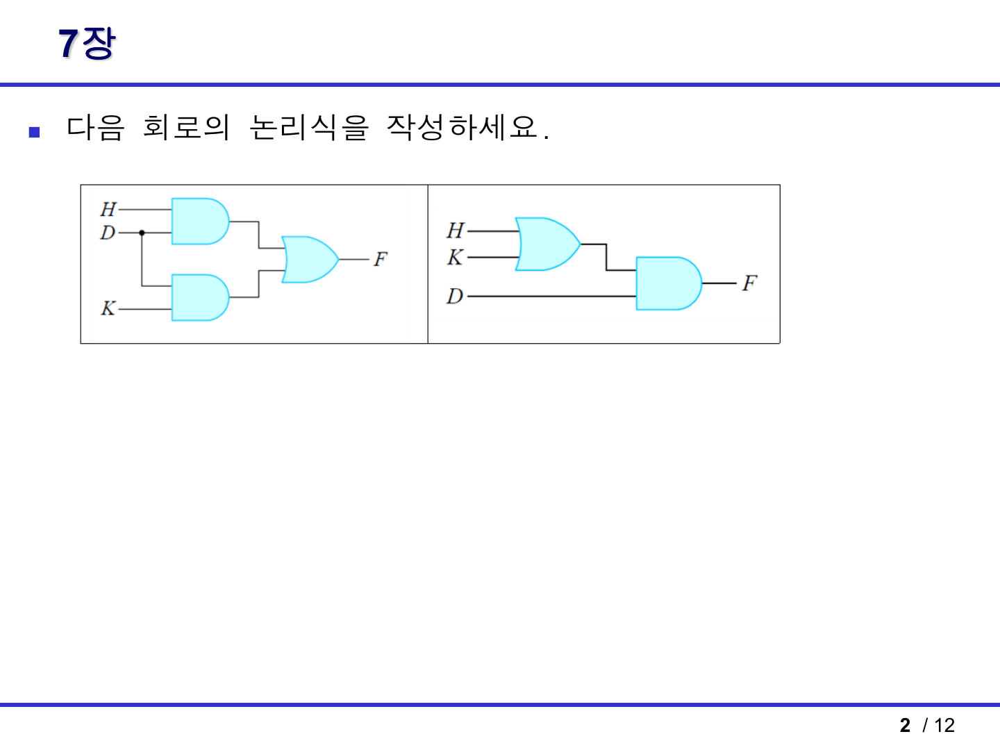

### 문제

두 회로의 논리식을 작성한다.

### 왼쪽 회로 풀이

입력은 `H`, `D`, `K`다. 왼쪽 회로는 AND 게이트 두 개와 OR 게이트 한 개로 되어 있다.

1. 위 AND 게이트 입력은 `H`와 `D`다.
   - 위 AND 출력: `HD`
2. 아래 AND 게이트 입력은 `D`와 `K`다.
   - 아래 AND 출력: `DK`
3. 두 AND 출력이 OR 게이트로 들어간다.
   - 최종 출력: `F = HD + DK`
4. 공통으로 들어 있는 `D`를 묶는다.
   - `F = D(H + K)`

답:

```text
F = HD + DK = D(H + K)
```

### 오른쪽 회로 풀이

오른쪽 회로는 먼저 `H`와 `K`를 OR로 더한 뒤, 그 결과를 `D`와 AND한다.

1. OR 게이트 출력: `H + K`
2. AND 게이트 출력: `D(H + K)`

답:

```text
F = D(H + K)
```

### 결론

두 회로는 겉모양은 다르지만 최종 논리식이 같다.

```text
HD + DK = D(H + K)
```

즉 왼쪽 회로와 오른쪽 회로는 같은 기능을 한다.

### 시험 포인트

- 회로식 문제는 한 번에 최종식을 쓰려 하지 말고, 게이트별 중간 출력을 먼저 적는다.
- 공통 인수분해가 보이면 회로를 더 단순하게 바꿀 수 있다.
- 이 문제는 분배법칙 `AB + AC = A(B + C)`를 묻는 유형이다.

---

## 2. 힌트 PDF 3쪽: 6장 카르노맵 간소화

### PDF 문제 원문

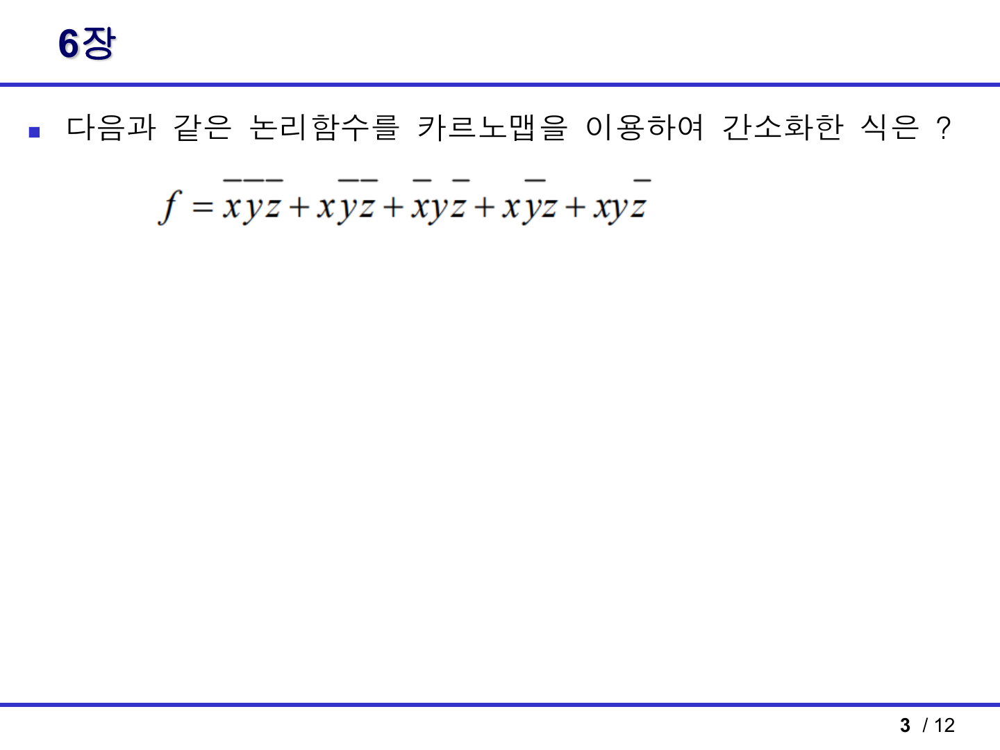

### 문제

다음 논리함수를 카르노맵으로 간소화한다.

```text
f = x'y'z' + x'y'z + x'yz' + xy'z + xyz'
```

### 1단계: 각 항을 minterm 번호로 바꾸기

변수 순서는 `x y z`로 본다.

| 항 | x y z 값 | minterm |
|---|---|---:|
| `x'y'z'` | 000 | m0 |
| `x'y'z` | 001 | m1 |
| `x'yz'` | 010 | m2 |
| `xy'z` | 101 | m5 |
| `xyz'` | 110 | m6 |

따라서

```text
f = Σm(0, 1, 2, 5, 6)
```

### 2단계: 3변수 K-map에 1 배치

열 순서는 `yz = 00, 01, 11, 10`이다.

| x \ yz | 00 | 01 | 11 | 10 |
|---|---:|---:|---:|---:|
| 0 | 1 | 1 | 0 | 1 |
| 1 | 0 | 1 | 0 | 1 |

### 3단계: 묶음 만들기

필수로 커버해야 하는 1은 `m0, m1, m2, m5, m6`이다.

묶음 A:

- `yz = 01` 열의 위아래 1을 묶는다.
- 포함 minterm: `m1, m5`
- 이 묶음에서 `y=0`, `z=1`은 고정이고 `x`만 변한다.
- 항: `y'z`

묶음 B:

- `yz = 10` 열의 위아래 1을 묶는다.
- 포함 minterm: `m2, m6`
- 이 묶음에서 `y=1`, `z=0`은 고정이고 `x`만 변한다.
- 항: `yz'`

묶음 C:

- `x=0` 행에서 `yz=00`과 `yz=01`을 묶는다.
- 포함 minterm: `m0, m1`
- 이 묶음에서 `x=0`, `y=0`은 고정이고 `z`만 변한다.
- 항: `x'y'`

### 답

```text
f = x'y' + y'z + yz'
```

동일하게 최소항을 묶는 방법에 따라 다음 식도 같은 최소형으로 볼 수 있다.

```text
f = x'z' + y'z + yz'
```

두 식 모두 원래 1인 칸만 덮는다. 선택지형 시험이면 보기 중 같은 형태를 고르면 된다.

### 시험 포인트

- 보수 표시를 잘못 읽으면 minterm이 전부 틀어진다.
- `m5`는 `101`, `m6`은 `110`이다. 3변수에서 minterm 번호는 `xyz`를 2진수로 본다.
- 답이 하나로만 나오지 않을 수 있다. 같은 크기의 묶음 선택지가 여러 개면 동치인 최소식이 생긴다.

---

## 3. 힌트 PDF 4쪽: 7장 가산기

### PDF 출제 단서

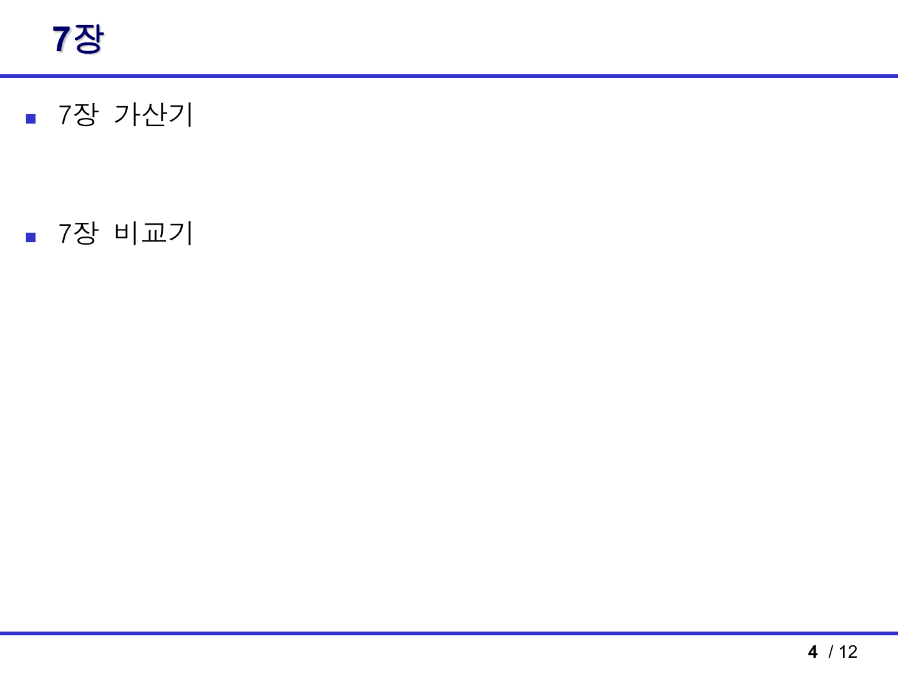

힌트 PDF 4쪽은 “7장 가산기”가 나온다는 범위 힌트다. 이 유형은 공식만 외우는 것보다 진리표에서 식이 왜 나오는지 알아두면 객관식이 바뀌어도 맞출 수 있다.

### 반가산기

반가산기는 입력 `A`, `B` 두 비트를 더해서 합 `S`와 자리올림 `C`를 만든다.

| A | B | S | C |
|---:|---:|---:|---:|
| 0 | 0 | 0 | 0 |
| 0 | 1 | 1 | 0 |
| 1 | 0 | 1 | 0 |
| 1 | 1 | 0 | 1 |

합 `S`는 두 입력이 서로 다를 때 1이다.

```text
S = A xor B = A'B + AB'
```

자리올림 `C`는 두 입력이 모두 1일 때만 1이다.

```text
C = AB
```

### 전가산기

전가산기는 입력 `A`, `B`, `Cin` 세 비트를 더한다.

합은 1의 개수가 홀수일 때 1이므로 XOR로 표현한다.

```text
S = A xor B xor Cin
```

자리올림은 세 입력 중 적어도 두 개가 1일 때 1이다.

```text
Cout = AB + ACin + BCin
```

다른 형태로는 다음처럼도 쓴다.

```text
Cout = AB + (A xor B)Cin
```

### 4비트 병렬 가산기

4비트 병렬 가산기는 전가산기 4개를 연결한다.

- 최하위 비트에서 나온 carry가 다음 비트의 `Cin`으로 들어간다.
- 이런 방식은 ripple carry 방식이다.
- 구조를 보면 FA가 여러 개 줄줄이 연결되어 있다.

### 가산기/감산기 판별

퀴즈 힌트 PDF 5쪽처럼 `B` 입력마다 XOR 게이트가 붙고 제어 입력 `S`가 같이 들어가면 4비트 병렬 가산기/감산기다.

- `S=0`: `B xor 0 = B`, `C0=0`이므로 `A + B`
- `S=1`: `B xor 1 = B'`, `C0=1`이므로 `A + B' + 1 = A - B`

답:

```text
4비트 병렬 가산기/감산기
```

### 시험 포인트

- `FA`가 여러 개 있으면 병렬 가산기 계열을 의심한다.
- `B` 입력에 XOR가 붙어 있고 제어선이 `C0`에도 들어가면 감산 기능까지 있는 회로다.
- 2의 보수 감산은 `A - B = A + B' + 1`로 처리한다.

---

## 4. 힌트 PDF 4쪽: 7장 비교기

### PDF 출제 단서


### 1비트 비교기

입력 `A`, `B`를 비교할 때 가능한 결과는 세 가지다.

| A | B | A>B | A=B | A<B |
|---:|---:|---:|---:|---:|
| 0 | 0 | 0 | 1 | 0 |
| 0 | 1 | 0 | 0 | 1 |
| 1 | 0 | 1 | 0 | 0 |
| 1 | 1 | 0 | 1 | 0 |

각 출력식은 다음과 같다.

```text
A > B = AB'
A = B = A'B' + AB = A xnor B
A < B = A'B
```

### 다중 비트 비교기

여러 비트 비교는 최상위 비트부터 본다.

예를 들어 2비트 수 `A1A0`, `B1B0`를 비교하면:

```text
A > B = A1B1' + (A1 xnor B1)A0B0'
A = B = (A1 xnor B1)(A0 xnor B0)
A < B = A1'B1 + (A1 xnor B1)A0'B0
```

해석:

- 먼저 최상위 비트 `A1`과 `B1`를 비교한다.
- 최상위 비트에서 이미 크기가 결정되면 하위 비트는 볼 필요가 없다.
- 최상위 비트가 같을 때만 하위 비트를 비교한다.

### 시험 포인트

- `A=B`는 XNOR다.
- 다중 비트 비교기는 “높은 자리 우선”이 핵심이다.
- 객관식에서 `AB'`, `A'B`, `AB + A'B'`가 보이면 1비트 비교기 공식과 연결한다.

---

## 5. 힌트 PDF 5쪽: NOR SR 래치 진리표

### PDF 문제 원문

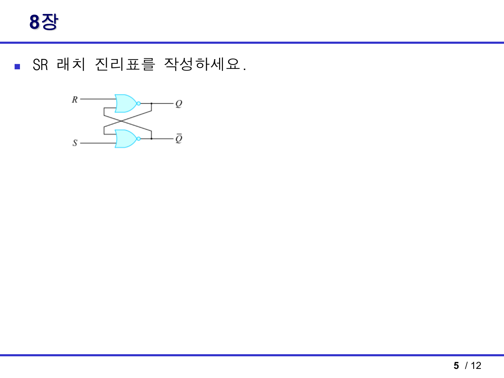

### 문제

NOR 게이트로 만든 SR 래치의 진리표를 작성한다.

그림에서는 위쪽 입력이 `R`, 아래쪽 입력이 `S`다. 하지만 표는 보통 `S, R` 순서로 쓴다. 이 순서를 헷갈리면 Set과 Reset이 뒤집힌다.

### NOR SR 래치의 동작

NOR 게이트는 입력 중 하나라도 1이면 출력이 0이다.

NOR SR 래치에서는:

- `S=1, R=0`: Set, `Q=1`
- `S=0, R=1`: Reset, `Q=0`
- `S=0, R=0`: 이전 상태 유지
- `S=1, R=1`: 금지 상태

### 진리표

| S | R | Q 다음 상태 `Q(n+1)` | 의미 |
|---:|---:|---|---|
| 0 | 0 | `Q(n)` | 유지 |
| 0 | 1 | 0 | Reset |
| 1 | 0 | 1 | Set |
| 1 | 1 | 부정/금지 | 두 NOR 출력이 모두 0이 되어 정상 보수 관계가 깨짐 |

### 왜 `S=R=1`이 금지인가

NOR 래치에서 `S=1`이면 아래쪽 NOR 출력인 `Q'`가 0이 된다. `R=1`이면 위쪽 NOR 출력인 `Q`도 0이 된다.

그러면 `Q=0`, `Q'=0`이 되어 원래 보수 관계인 `Q' = Q의 반대`가 깨진다. 그래서 `S=R=1`은 금지 또는 부정 상태라고 쓴다.

### 시험 포인트

- NOR형 SR 래치는 입력이 active-high다.
- Set은 `S=1`, Reset은 `R=1`이다.
- NAND형 SR 래치는 보통 active-low라 표가 반대로 나온다. 이 문제는 NOR형이다.

---

## 6. 힌트 PDF 6쪽: NOR SR 래치 파형

### PDF 문제 원문

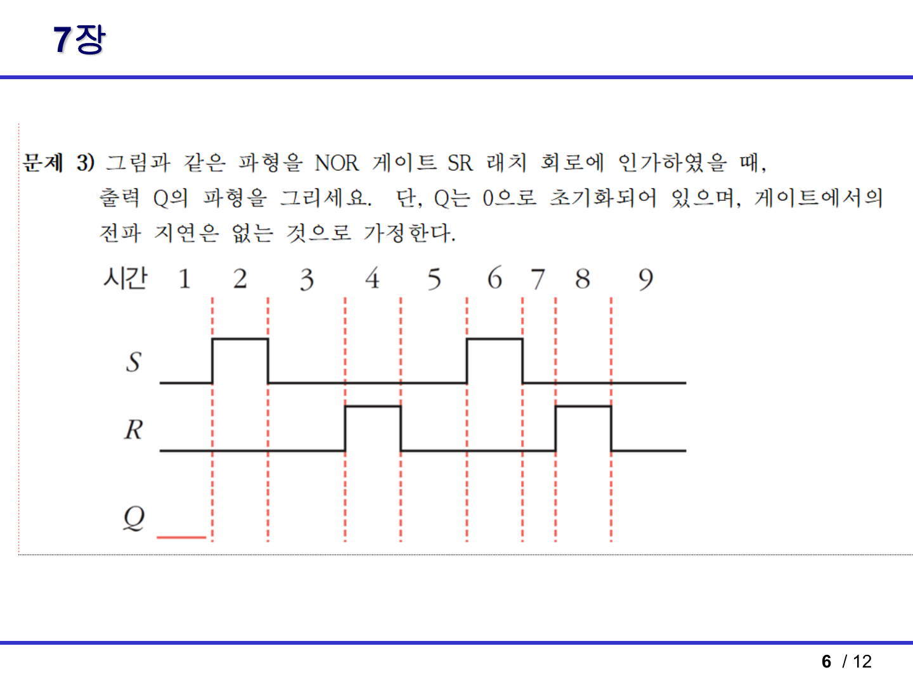

### 문제 조건

- NOR 게이트 SR 래치
- 초기 `Q = 0`
- 게이트 전파 지연 없음
- 입력 파형 `S`, `R`이 주어졌을 때 출력 `Q` 파형을 그린다.

### 풀이 원리

파형을 외우지 말고 구간마다 아래 규칙을 적용한다.

| S | R | Q |
|---:|---:|---|
| 0 | 0 | 이전 Q 유지 |
| 0 | 1 | 0 |
| 1 | 0 | 1 |
| 1 | 1 | 금지 |

### 구간별 해설

초기값이 `Q=0`이다.

1. 첫 번째 `S` 펄스가 올라가기 전
   - `S=0`, `R=0`
   - 유지이므로 `Q=0`

2. 첫 번째 `S` 펄스 구간
   - `S=1`, `R=0`
   - Set이므로 `Q=1`

3. 첫 번째 `S` 펄스가 내려간 뒤, 첫 번째 `R` 펄스 전
   - `S=0`, `R=0`
   - 유지이므로 `Q=1`

4. 첫 번째 `R` 펄스 구간
   - `S=0`, `R=1`
   - Reset이므로 `Q=0`

5. 첫 번째 `R` 펄스가 내려간 뒤, 두 번째 `S` 펄스 전
   - `S=0`, `R=0`
   - 유지이므로 `Q=0`

6. 두 번째 `S` 펄스 구간
   - `S=1`, `R=0`
   - Set이므로 `Q=1`

7. 두 번째 `S` 펄스가 내려간 뒤, 두 번째 `R` 펄스 전
   - `S=0`, `R=0`
   - 유지이므로 `Q=1`

8. 두 번째 `R` 펄스 구간
   - `S=0`, `R=1`
   - Reset이므로 `Q=0`

9. 두 번째 `R` 펄스 이후
   - `S=0`, `R=0`
   - 유지이므로 `Q=0`

### 답안으로 그릴 Q 파형

글로 쓰면 다음과 같다.

```text
Q는 처음 0이다.
첫 S 펄스에서 1로 올라간다.
첫 R 펄스에서 0으로 내려간다.
두 번째 S 펄스에서 다시 1로 올라간다.
두 번째 R 펄스에서 다시 0으로 내려간다.
그 사이 S=R=0인 구간은 직전 값을 유지한다.
```

### 시험 포인트

- 래치는 클록 에지가 아니라 입력 레벨에 반응한다.
- `S`가 1인 구간에서 Set, `R`이 1인 구간에서 Reset이다.
- 지연이 없다고 했으므로 입력이 바뀌는 순간 바로 `Q`가 바뀐다고 그린다.

---

## 7. 힌트 PDF 7쪽: NAND 회로 출력 간소화

### PDF 문제 원문

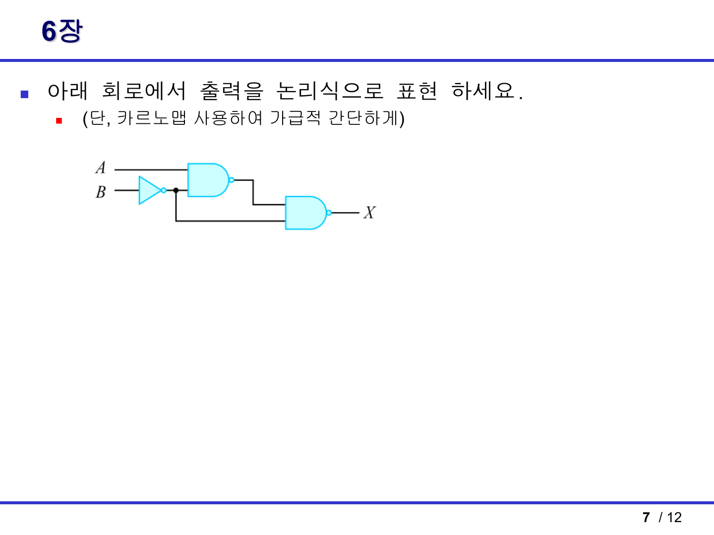

### 문제

아래 회로에서 출력 `X`를 논리식으로 표현하고, 카르노맵 또는 논리 법칙으로 간단히 한다.

### 1단계: 중간 신호 만들기

입력 `B`가 먼저 NOT 게이트를 통과한다.

```text
B -> B'
```

첫 번째 NAND 게이트 입력은 `A`와 `B'`다.

```text
N1 = (AB')'
```

마지막 NAND 게이트 입력은 `N1`과 `B'`다.

```text
X = (N1 · B')'
```

따라서

```text
X = ((AB')'B')'
```

### 2단계: 드모르간 적용

```text
X = ((AB')'B')'
```

`(PQ)' = P' + Q'`를 적용한다.

```text
X = ((AB')')' + (B')'
```

이중 보수를 제거한다.

```text
X = AB' + B
```

흡수법칙을 적용한다.

```text
AB' + B = A + B
```

### 답

```text
X = A + B
```

### 진리표로 확인

| A | B | B' | N1=(AB')' | X=(N1B')' | A+B |
|---:|---:|---:|---:|---:|---:|
| 0 | 0 | 1 | 1 | 0 | 0 |
| 0 | 1 | 0 | 1 | 1 | 1 |
| 1 | 0 | 1 | 0 | 1 | 1 |
| 1 | 1 | 0 | 1 | 1 | 1 |

`X`열과 `A+B`열이 같으므로 최종식 `A+B`가 맞다.

### 시험 포인트

- NAND는 출력에 보수가 붙는다. 중간 출력을 괄호로 정확히 잡아야 한다.
- `B'`가 두 군데로 갈라져 들어가므로 배선을 놓치면 안 된다.
- 마지막에 `AB' + B = A + B`로 줄이는 흡수법칙을 기억한다.

---

## 8. 퀴즈 힌트 2쪽: 2변수 진리표 간소화 1

### PDF 문제 원문

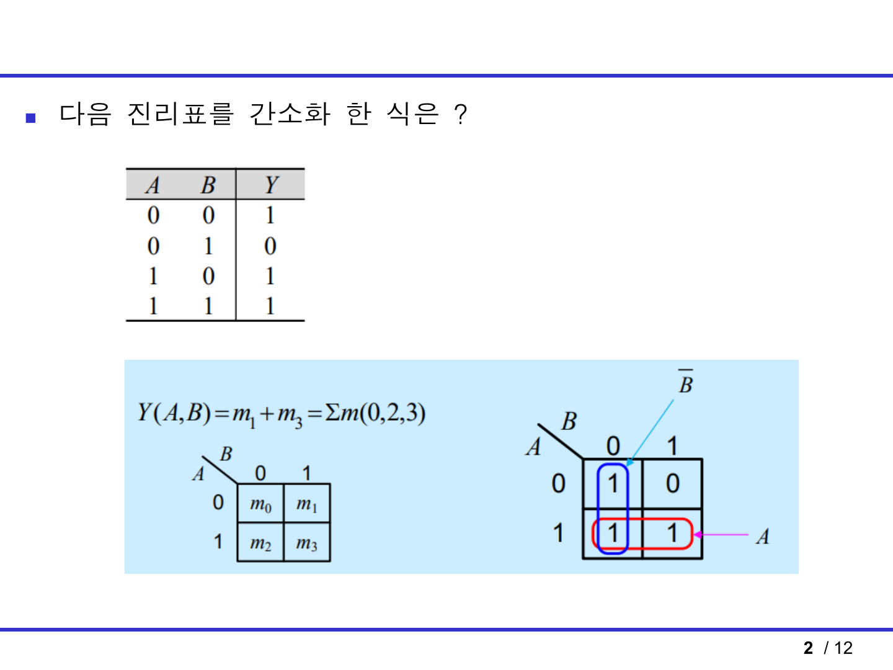

### 문제 진리표

| A | B | Y |
|---:|---:|---:|
| 0 | 0 | 1 |
| 0 | 1 | 0 |
| 1 | 0 | 1 |
| 1 | 1 | 1 |

### 1단계: 1이 되는 행 찾기

`Y=1`인 행은 다음과 같다.

| A | B | minterm |
|---:|---:|---:|
| 0 | 0 | m0 |
| 1 | 0 | m2 |
| 1 | 1 | m3 |

따라서

```text
Y = Σm(0, 2, 3)
```

### 2단계: K-map 묶기

2변수 K-map은 다음처럼 본다.

| A \ B | 0 | 1 |
|---|---:|---:|
| 0 | 1 | 0 |
| 1 | 1 | 1 |

묶음 1:

- `A=1`인 아래 행 두 칸을 묶는다.
- `B`는 0에서 1로 변하므로 사라진다.
- 항: `A`

묶음 2:

- `B=0`인 왼쪽 열 두 칸을 묶는다.
- `A`는 0에서 1로 변하므로 사라진다.
- 항: `B'`

### 답

```text
Y = A + B'
```

### 시험 포인트

- `A=1`인 행 전체가 1이면 항은 `A`다.
- `B=0`인 열 전체가 1이면 항은 `B'`다.

---

## 9. 퀴즈 힌트 3쪽: 3변수 진리표 간소화

### PDF 문제 원문

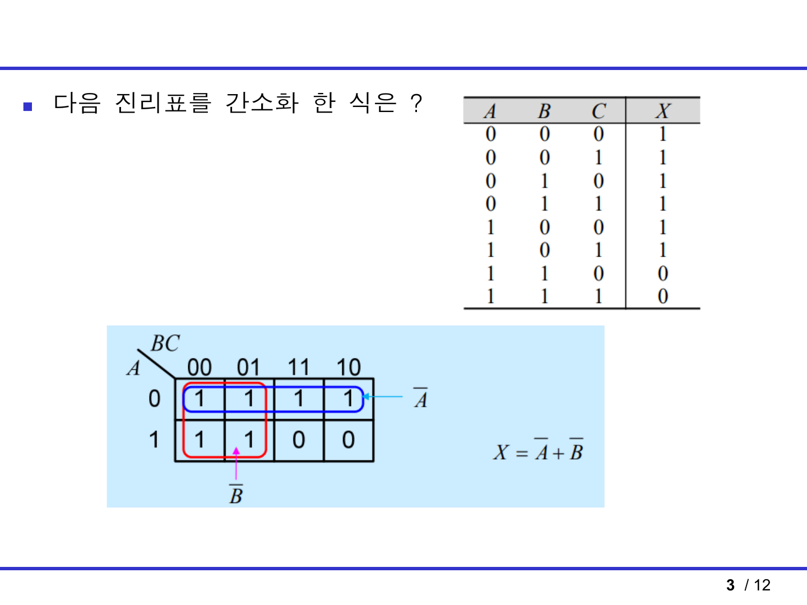

### 문제 진리표 요약

`X=1`인 행은 `A=0`인 모든 행과, `A=1`이면서 `B=0`인 행이다. 반대로 `A=1`, `B=1`인 행에서는 `X=0`이다.

### K-map

열 순서는 `BC = 00, 01, 11, 10`이다.

| A \ BC | 00 | 01 | 11 | 10 |
|---|---:|---:|---:|---:|
| 0 | 1 | 1 | 1 | 1 |
| 1 | 1 | 1 | 0 | 0 |

### 묶음 풀이

묶음 1:

- `A=0`인 윗행 네 칸을 묶는다.
- `B`, `C`는 변하고 `A=0`만 고정이다.
- 항: `A'`

묶음 2:

- `B=0`인 두 열 `BC=00`, `BC=01`을 위아래 포함해 네 칸으로 묶는다.
- `A`, `C`는 변하고 `B=0`만 고정이다.
- 항: `B'`

### 답

```text
X = A' + B'
```

### 시험 포인트

- 4칸 묶음은 변수가 2개 사라지고 1개만 남는다.
- 3변수 K-map에서도 열 순서가 `00, 01, 11, 10`이다.

---

## 10. 퀴즈 힌트 4쪽: 무관항 포함 4변수 K-map

### PDF 문제 원문

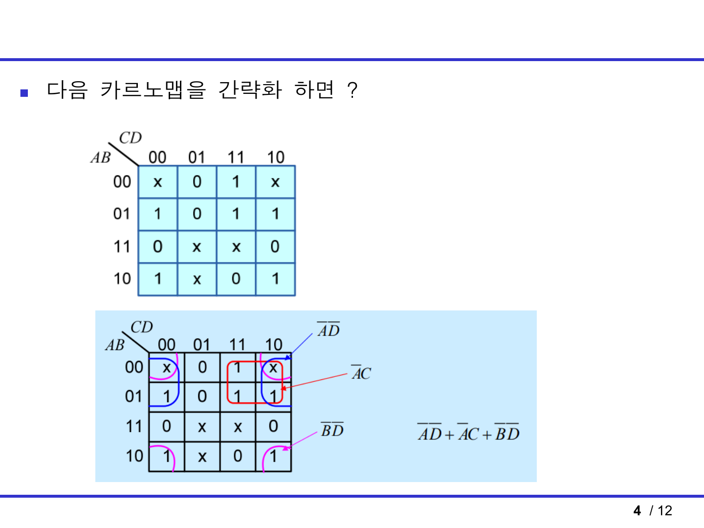

### 문제

4변수 K-map이 주어지고, `1`, `0`, `x`가 섞여 있다.

행은 `AB = 00, 01, 11, 10`, 열은 `CD = 00, 01, 11, 10`이다.

### 핵심

`x`는 무관항이다. 더 큰 묶음을 만들 수 있으면 1처럼 사용하고, 필요 없으면 버린다.

### 묶음 1: `A'D'`

사용하는 칸:

- `AB=00`, `AB=01`
- `CD=00`, `CD=10`
- 좌우 끝 열은 서로 인접하므로 wrap-around 묶음이 가능하다.

이 묶음에서:

- `A=0`은 고정
- `D=0`은 고정
- `B`, `C`는 변함

따라서 항은:

```text
A'D'
```

### 묶음 2: `A'C`

사용하는 칸:

- `AB=00`, `AB=01`
- `CD=11`, `CD=10`

이 묶음에서:

- `A=0`은 고정
- `C=1`은 고정
- `B`, `D`는 변함

따라서 항은:

```text
A'C
```

### 묶음 3: `B'D'`

사용하는 칸:

- `AB=00`, `AB=10`
- `CD=00`, `CD=10`
- 위아래 끝 행과 좌우 끝 열을 함께 이어서 모서리 네 칸을 묶는 형태다.

이 묶음에서:

- `B=0`은 고정
- `D=0`은 고정
- `A`, `C`는 변함

따라서 항은:

```text
B'D'
```

### 답

```text
F = A'D' + A'C + B'D'
```

### 시험 포인트

- 무관항 `x`를 쓰는 이유는 2칸 묶음을 4칸 묶음으로 키우기 위해서다.
- 모서리 네 칸도 서로 인접할 수 있다.
- 4변수에서 4칸 묶음을 만들면 변수 2개가 남는다.

---

## 11. 퀴즈 힌트 5쪽: 조합회로 명칭

### PDF 문제 원문

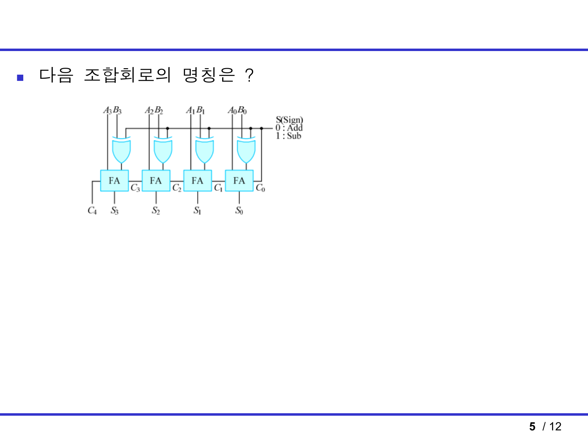

### 문제

FA 4개와 XOR 게이트 4개가 있는 조합회로의 명칭을 묻는다.

### 회로 해석

회로에는 `A3~A0`, `B3~B0` 입력이 있고, 각 자리마다 전가산기 `FA`가 있다.

또한 각 `B` 입력은 XOR 게이트를 거친다. XOR의 다른 입력은 제어선 `S`다.

```text
B_i xor S
```

제어선 설명은 다음과 같다.

```text
S = 0: Add
S = 1: Sub
```

### `S=0`일 때

```text
B_i xor 0 = B_i
C0 = 0
```

따라서 회로는 그냥 덧셈을 한다.

```text
A + B
```

### `S=1`일 때

```text
B_i xor 1 = B_i'
C0 = 1
```

따라서 회로는 다음을 계산한다.

```text
A + B' + 1
```

`B' + 1`은 `B`의 2의 보수이므로:

```text
A + B' + 1 = A - B
```

### 답

```text
4비트 병렬 가산기/감산기
```

또는

```text
4-bit parallel adder/subtractor
```

### 시험 포인트

- `FA`가 4개면 4비트 병렬 가산기 구조다.
- `B` 쪽에 XOR가 있고 제어선 `S`가 들어가면 감산 기능까지 있다.
- `S=1`에서 `B`를 반전하고 `C0=1`을 더하는 것이 2의 보수 감산이다.

---

## 12. 퀴즈 힌트 6쪽: NOR 게이트 SR 플립플롭 진리표

### PDF 문제 원문

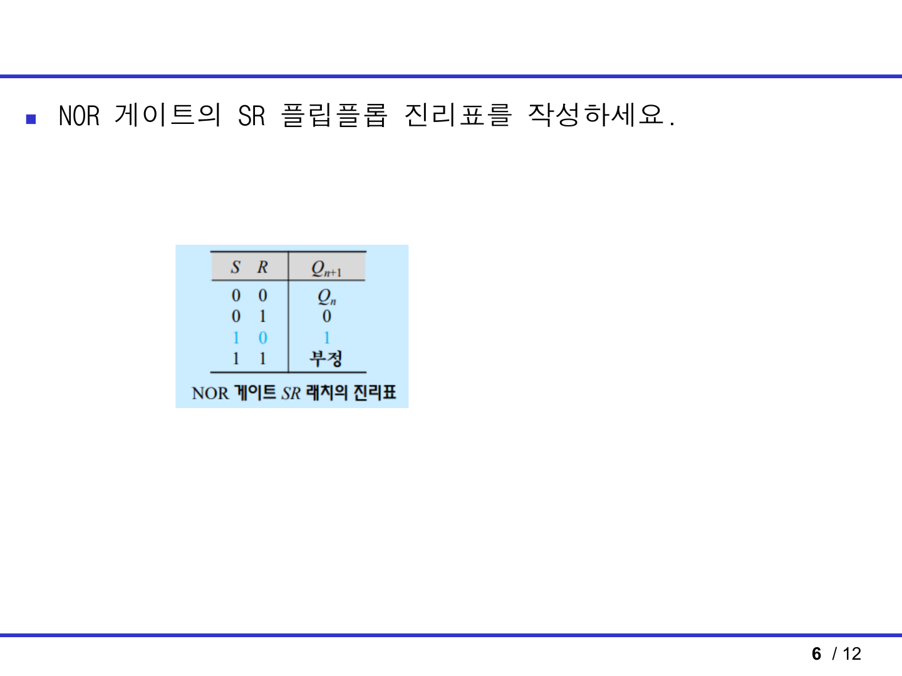

자료에는 “SR 플립플롭”이라고 되어 있지만, 그림과 표의 동작은 NOR형 SR 래치/플립플롭 기본 진리표와 같다. 시험에서는 아래 표를 쓰면 된다.

| S | R | Q(n+1) | 의미 |
|---:|---:|---|---|
| 0 | 0 | `Q(n)` | 유지 |
| 0 | 1 | 0 | Reset |
| 1 | 0 | 1 | Set |
| 1 | 1 | 부정/금지 | 사용 금지 |

### 풀이 설명

- `S=0, R=0`: 두 입력이 모두 비활성이라 현재 상태를 유지한다.
- `S=0, R=1`: Reset 입력이 활성화되어 다음 `Q`가 0이다.
- `S=1, R=0`: Set 입력이 활성화되어 다음 `Q`가 1이다.
- `S=1, R=1`: Set과 Reset을 동시에 요구하므로 정상적인 저장 상태가 아니다.

### 시험 포인트

- NOR형은 `S`와 `R`이 1일 때 동작하는 active-high 입력이다.
- NAND형은 보통 active-low라 표가 반대로 나온다.
- `S=R=1`은 “1”이나 “유지”가 아니라 금지/부정이다.

---

## 13. 8장 플립플롭 기본표

힌트에는 SR 래치가 직접 나왔지만, 시험 범위상 D/JK/T 플립플롭 표도 같이 고정해야 한다.

### D 플립플롭

```text
Q(n+1) = D
```

| D | Q(n+1) |
|---:|---:|
| 0 | 0 |
| 1 | 1 |

해석: 클록 에지에서 입력 `D`가 그대로 저장된다.

### JK 플립플롭

| J | K | Q(n+1) | 의미 |
|---:|---:|---|---|
| 0 | 0 | `Q(n)` | 유지 |
| 0 | 1 | 0 | Reset |
| 1 | 0 | 1 | Set |
| 1 | 1 | `Q(n)'` | Toggle |

특성식:

```text
Q(n+1) = JQ' + K'Q
```

해석: JK는 SR의 금지 상태를 toggle로 바꾼 플립플롭이다.

### T 플립플롭

| T | Q(n+1) | 의미 |
|---:|---|---|
| 0 | `Q(n)` | 유지 |
| 1 | `Q(n)'` | Toggle |

특성식:

```text
Q(n+1) = T xor Q
```

해석: T가 1인 클록 에지마다 출력이 반전된다.

---

## 14. 마지막 10분 체크

- 회로식은 게이트마다 중간 출력부터 적는다.
- 보수 표시를 minterm으로 바꾼 뒤 K-map에 넣는다.
- K-map 열/행 순서는 `00, 01, 11, 10`이다.
- 묶음은 1, 2, 4, 8개만 가능하고 가장자리끼리 이어진다.
- 무관항 `x`는 큰 묶음을 만들 때만 쓴다.
- 반가산기: `S = A xor B`, `C = AB`
- 전가산기: `S = A xor B xor Cin`, `Cout = AB + ACin + BCin`
- 1비트 비교기: `A>B = AB'`, `A=B = A'B' + AB`, `A<B = A'B`
- 4비트 가산기/감산기는 `B xor S`와 `C0=S`를 찾는다.
- NOR SR 래치: `00 유지`, `01 Reset`, `10 Set`, `11 금지`
- 래치 파형은 `S` 펄스에서 올라가고 `R` 펄스에서 내려간다.
- NAND 회로는 중간 출력의 보수를 괄호로 끝까지 유지한다.
